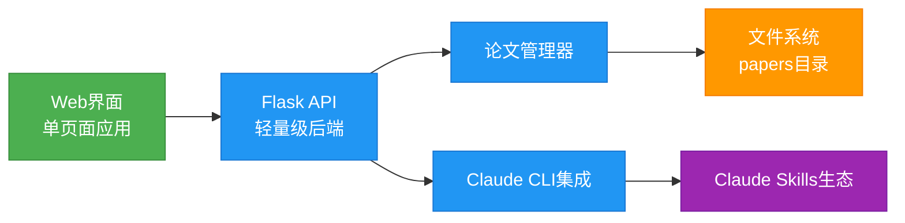

# Agentic AI Papers Collection & Translation Platform 🔬

这是一个专注于 Agentic AI 研究的学术论文收集、翻译和管理平台，致力于为中文读者提供高质量的人工智能智能体领域技术资源。

## 📋 项目概览

本平台提供：

- 📚 **论文收集**: 系统性收集 Agentic AI 领域重要研究论文
- 🔄 **智能翻译**: 基于 AI 的高质量中文翻译
- 🤖 **Agent 工具**: 专门用于处理学术论文的智能代理
- 🖥️ **管理界面**: Web UI 用于管理论文和翻译流程

## 🏗️ 仓库结构

```bash
agentic-ai-papers/
├── agents/             # AI 代理实现
│   ├── claude/         # 基于 Claude Agent SDK 的代理
│   └── adk/            # 基于 Google ADK 的代理
├── ui/                 # 基于 React 的 Web 管理界面
├── papers/             # 论文存储
│   ├── source/         # 原始文档本地存储 (PDF/Web Page)
│   ├── images/         # 原始文档中抓取的图片（供 Markdown 文档引用）
│   ├── translation/    # 中文翻译 (Markdown)
│   └── heartfelt/      # 愫读摘要与心得体会 (Markdown)
├── docs/               # 工程文档
├── .claude/            # Claude 配置和提示
└── skills/             # Claude Agent Skills
```

## 🎯 核心功能

### 智能论文处理

- 解析和提取 PDF/Web Page 内容
- 识别和提取数学公式和表格
- 提取图像和图表
- 自动分类和标签

### 高质量翻译

- 保持技术术语准确性
- 保留数学公式格式
- 适应中文表达习惯
- 翻译质量评估

### 深度解读

- 核心贡献总结
- 技术要点分析
- 相关研究对比
- 实践应用建议

## 📋 工程实施计划方案

### 📊 项目现状

#### ✅ 已完成的核心功能

1. **完整的 Claude Skills 生态系统** (7 个技能):

   - `doc-translator`: 文档翻译工作流协调器
   - `pdf-reader`: PDF 内容提取(支持图片/表格/公式)
   - `web-translator`: 网页内容提取和转换
   - `zh-translator`: 中文翻译(保持格式)
   - `markdown-formatter`: Markdown 格式优化
   - `batch-processor`: 大文档批处理
   - `heartfelt`: 深度阅读和摘要生成

2. **丰富的论文库**:
   - 20+ 篇分类整理的 PDF 论文
   - 15+ 篇已完成中文翻译
   - 清晰的目录结构 (source/, translation/, heartfelt/, images/)

#### ❌ 需要优化的部分

1. **过度设计的全栈基础设施**: PostgreSQL, Redis, MinIO, Celery 等重型组件
2. **空目录结构**: UI 工作空间未实现，agent 目录仅有 README

### 🎯 精简实施策略

**核心理念**: 利用现有的 Claude Skills 生态，构建轻量级管理界面，避免过度工程化。



### 🚀 基于 Claude Agent SDK 的实施阶段

#### Phase 1: Agent SDK 服务架构 (2.5 小时)

- 创建基于 Claude Agent SDK 的 Agent 服务
- 封装现有 Skills 为标准化 Agent
- 实现异步处理架构

#### Phase 2: FastAPI 服务实现 (1.5 小时)

- 构建轻量级 API 服务
- 实现论文和任务管理接口
- 集成 Agent SDK 调用

#### Phase 3: 简化 Web 界面 (可选，1 小时)

- 创建单页面应用（可选）
- 实现文件上传和进度展示
- 集成 API 调用

#### Phase 4: 极简部署配置 (30 分钟)

- 移除重型基础设施 (PostgreSQL, Redis, MinIO, Celery)
- 更新 docker-compose.yml 为单服务
- 创建最小化 Dockerfile

#### Phase 5: Agent 自动化工作流 (1 小时)

- 实现工作流协调 Agent
- 创建文件监控和自动处理
- 集成批处理和深度分析功能

### 📁 关键实施文件

**需要创建：**

1. **`/agents/claude/base.py`** - Agent SDK 基础类
2. **`/agents/claude/workflow_agent.py`** - 工作流协调 Agent
3. **`/agents/claude/pdf_agent.py`** - PDF 处理 Agent
4. **`/agents/claude/translation_agent.py`** - 翻译 Agent
5. **`/api/main.py`** - FastAPI 应用入口
6. **`/api/routes/papers.py`** - 论文管理接口
7. **`/api/services/paper_service.py`** - 业务逻辑层
8. **`Dockerfile`** - 应用容器化

**需要修改：**

1. **`pyproject.toml`** - 简化依赖，添加 claude-agent-sdk
2. **`docker-compose.yml`** - 精简服务配置
3. **`README.md`** - 更新部署和使用说明

### ✅ 优化后的优势

- **标准化架构**: 基于 Claude Agent SDK 的标准化 Agent 实现
- **异步处理**: 全异步架构，提高并发处理能力
- **清晰分层**: Agent -> Service -> API 的清晰分层
- **极简部署**: 单一 API 服务 + 可选 UI
- **易于扩展**: 每个 skill 对应一个 Agent，易于独立开发和测试

_完整实施计划详见: [工程实施计划详细方案](.claude/plans/joyful-mapping-gosling.md)_

## 🚀 快速开始

### 环境要求

- Python 3.12+
- Node.js 24+
- PostgreSQL 16+
- Redis 6+

### 安装步骤

1. **克隆仓库**

```bash
git clone https://github.com/yourusername/agentic-ai-papers.git
cd agentic-ai-papers
```

2. **安装 Agent 环境**

```bash
# Claude Agents
pip install claude-agent-sdk

# Google ADK Agents
pip install google-adk
```

3. **安装 UI 环境**

```bash
cd ui
npm run install:all
```

4. **配置环境变量**

```bash
cp .env.example .env
# 编辑 .env 文件
```

5. **启动服务**

```bash
# 使用 Docker Compose (推荐)
docker-compose up -d

# 或手动启动
npm run dev
```

## 📖 使用指南

### 添加新论文

1. 将 PDF 或网页链接添加到 `papers/source/` 对应分类目录
2. 使用 Agent 进行内容提取：`python agents/claude/extract.py`
3. 运行翻译：`python agents/claude/translate.py`
4. 生成深度解读：`python agents/claude/analyze.py`

### 使用 Web UI

1. 访问 `http://localhost:3000`
2. 上传论文或输入 URL
3. 监控处理进度
4. 查看和管理翻译结果

## 🌟 研究领域

### LLM Agents

- Agent 架构设计
- Tool 使用和学习
- 多 Agent 协作
- 规划和推理

### Context Engineering

- 上下文管理策略
- 提示工程技术
- 记忆机制设计
- 会话状态维护

### Knowledge Graphs

- 知识表示方法
- 图神经网络
- 知识增强生成
- 推理和查询

### Multi-Agent Systems

- 协作机制
- 通信协议
- 任务分配
- 涌现行为

## 🤝 贡献方式

我们欢迎社区贡献！您可以：

- 📝 **提交新论文**: 添加重要的 Agentic AI 研究论文
- 🔄 **改进翻译**: 提升翻译质量和准确性
- 🛠️ **开发 Agent**: 贡献新的处理能力
- 🐛 **报告问题**: 帮助改进平台功能
- 📚 **完善文档**: 改进使用指南和说明

## 📊 项目统计

- 📄 **论文总数**: 20+ 篇
- 🌐 **翻译完成**: 15+ 篇
- 📂 **研究领域**: 6 个主要方向
- 🤖 **Agent 数量**: 10+ 个专用代理
- 🔄 **持续更新**: 每周添加新内容

## 📜 许可证

本项目采用 [MIT License](LICENSE)，所有翻译内容仅供学术研究使用。原始论文的版权属于相应的出版机构和作者。

## 🔗 相关链接

- [Claude Agent SDK](https://github.com/anthropics/claude-agent-sdk)
- [Google Agent Development Kit](https://developers.google.com/agent-kit)
- [Agentic AI Survey](https://arxiv.org/abs/2401.01268)
- [Agent Project](https://agent.supply/) - 中文 Agent 项目聚合

---

**注意**: 本项目的内容仅供学术研究和教育目的使用。在使用翻译内容时，请引用原始论文的完整来源信息。
