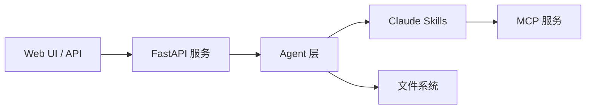

# Agentic AI Papers Collection & Translation Platform 🔬

一个专注于 Agentic AI 研究的学术论文收集、翻译和管理平台，致力于为中文读者提供高质量的人工智能智能体领域技术资源。

## 📋 项目概览

本平台提供：

- 📚 **论文收集**: 系统性收集 Agentic AI 领域重要研究论文
- 🔄 **智能翻译**: 基于 AI 的高质量中文翻译
- 🤖 **Agent 工具**: 专门用于处理学术论文的智能代理
- 🖥️ **管理界面**: Web UI 用于管理论文和翻译流程

## 📚 文档

详细文档请参考：

- [📖 架构设计方案](docs/01-Framework.md) - 系统架构、设计原则和技术栈
- [💻 开发与维护手册](docs/02-Development.md) - 开发指南、代码规范和最佳实践
- [👥 用户使用手册](docs/03-User-Guide.md) - 安装部署、使用教程和常见问题
- [🧪 自动化测试方案](docs/04-Testing.md) - 测试框架、测试策略和 CI/CD

## 🚀 快速开始

### 环境要求

- Python 3.12+
- Docker & Docker Compose（可选）
- Claude API Key

### Docker Compose 部署（推荐）

```bash
# 1. 克隆仓库
git clone https://github.com/ThreeFish-AI/agentic-ai-papers.git
cd agentic-ai-papers

# 2. 配置环境变量
cp .env.example .env
# 编辑 .env 文件，添加 ANTHROPIC_API_KEY

# 3. 启动服务
docker-compose up -d

# 4. 访问服务
# API 文档: http://localhost:8000/docs
# Web UI: http://localhost:3000
```

### 本地开发安装

```bash
# 1. 克隆仓库
git clone https://github.com/ThreeFish-AI/agentic-ai-papers.git
cd agentic-ai-papers

# 2. 创建虚拟环境
python -m venv venv
source venv/bin/activate  # Linux/Mac

# 3. 安装依赖
pip install -e .

# 4. 启动服务
uvicorn api.main:app --reload --host 0.0.0.0 --port 8000
```

## 🏗️ 核心架构

系统采用混合架构，结合 **Claude Agent SDK** 与 **MCP Skills**：



### 主要组件

- **Agent 层**: 基于 Claude Agent SDK 的标准化代理实现

  - `WorkflowAgent`: 工作流协调
  - `PDFProcessingAgent`: PDF 处理
  - `TranslationAgent`: 中文翻译
  - `HeartfeltAgent`: 深度分析
  - `BatchProcessingAgent`: 批量处理

- **API 层**: FastAPI 异步服务

  - RESTful API 接口
  - WebSocket 实时通信
  - 文件上传和下载

- **Skills**: 7 个专用 Claude Skills
  - `pdf-reader`: 内容提取
  - `zh-translator`: 中文翻译
  - `markdown-formatter`: 格式优化
  - `doc-translator`: 工作流协调
  - `batch-processor`: 批量处理
  - `heartfelt`: 深度解读
  - `web-translator`: 网页转换

## 📊 使用示例

### API 使用

```bash
# 上传论文
curl -X POST "http://localhost:8000/api/papers/upload" \
  -F "file=@paper.pdf" \
  -F "category=llm-agents"

# 翻译论文
curl -X POST "http://localhost:8000/api/papers/{paper_id}/translate"

# 获取翻译结果
curl "http://localhost:8000/api/papers/{paper_id}/translation"
```

### Python SDK

```python
from agentic_papers import AgenticPapersClient

client = AgenticPapersClient(base_url="http://localhost:8000")

# 上传并处理
paper = client.upload_paper("paper.pdf", category="llm-agents")
translation = paper.translate()
analysis = paper.analyze()
```

## 🌟 项目特色

### 精简实施策略

- 利用现有 Claude Skills 生态
- 本地开发优先设计
- 文件系统存储（无重型依赖）
- 单一 API 服务 + 可选 UI

### 高质量翻译

- 技术术语准确
- 公式格式保留
- 中文表达自然
- 质量可评估

### 深度分析

- 核心贡献总结
- 技术要点分析
- 相关研究对比
- 实践应用建议

## 📈 项目统计

- 📄 **论文总数**: 20+ 篇
- 🌐 **翻译完成**: 15+ 篇
- 📂 **研究领域**: 6 个主要方向
- 🤖 **Agent 数量**: 10+ 个专用代理
- 🔄 **持续更新**: 每周添加新内容

## 🤝 贡献方式

我们欢迎社区贡献！您可以：

- 📝 **提交新论文**: 添加重要的 Agentic AI 研究论文
- 🔄 **改进翻译**: 提升翻译质量和准确性
- 🛠️ **开发 Agent**: 贡献新的处理能力
- 🐛 **报告问题**: 帮助改进平台功能
- 📚 **完善文档**: 改进使用指南和说明

### 开发流程

1. Fork 项目
2. 创建功能分支 (`git checkout -b feature/AmazingFeature`)
3. 提交更改 (`git commit -m 'Add some AmazingFeature'`)
4. 推送到分支 (`git push origin feature/AmazingFeature`)
5. 创建 Pull Request

## 📜 许可证

本项目采用 [MIT License](LICENSE)，所有翻译内容仅供学术研究使用。原始论文的版权属于相应的出版机构和作者。

## 🔗 相关链接

- [Claude Agent SDK](https://github.com/anthropics/claude-agent-sdk)
- [Google Agent Development Kit](https://developers.google.com/agent-kit)
- [Agentic AI Survey](https://arxiv.org/abs/2401.01268)
- [Agent Project](https://agent.supply/) - 中文 Agent 项目聚合

## 📞 联系我们

- 项目主页: https://threefish.site
- 问题反馈: [GitHub Issues](https://github.com/ThreeFish-AI/agentic-ai-papers/issues)
- 邮箱: aurelius-shu@gmail.com

---

**注意**: 本项目的内容仅供学术研究和教育目的使用。在使用翻译内容时，请引用原始论文的完整来源信息。
