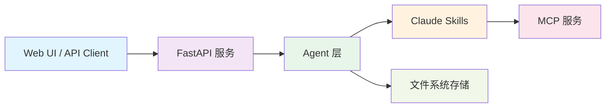

# Agentic AI Papers Collection & Translation Platform 🔬

一个专注于 Agentic AI 研究的学术论文收集、翻译和管理平台，基于 Claude Agent SDK 和 Claude Skills 构建，为中文读者提供高质量的人工智能智能体领域技术资源。

> **注意**: 项目目前处于 MVP 阶段，部分 AI 功能依赖的 `claude-agent-sdk` 暂未安装。详细架构说明请参考 [docs/01-framework.md](docs/01-framework.md)。

## 📋 核心功能

- 📚 **论文收集管理** - 系统性收集和分类 Agentic AI 领域研究论文
- 🔄 **AI 驱动翻译** - 基于 Claude 的高质量中文翻译
- 🤖 **智能工作流** - 自动化的论文处理和分析流程
- 🖥️ **RESTful API** - 完整的 API 接口支持

## 📚 文档

- [🗺️ Main Roadmap](docs/000-roadmap.md) - 项目整体路线图
- [📖 系统架构](docs/001-framework.md) - 架构设计和技术栈
- [💻 开发指南](docs/002-development.md) - 开发环境和代码规范
- [👥 用户手册](docs/003-user-guide.md) - 安装部署和使用教程
- [🧪 测试方案](docs/004-testing.md) - 测试框架和 CI/CD
- [🚀 GitHub Actions](docs/005-github-actions.md) - 自动化工作流

## 🚀 快速开始

### 环境要求

- Python 3.12+
- Docker & Docker Compose（推荐）
- Claude API Key

### Docker Compose 部署（推荐）

```bash
# 1. 克隆仓库
git clone https://github.com/ThreeFish-AI/agentic-ai-papers.git
cd agentic-ai-papers

# 2. 配置环境变量
cp .env.example .env
# 编辑 .env 文件，添加 ANTHROPIC_API_KEY

# 3. 启动服务
docker-compose up -d

# 4. 访问服务
# API 文档: http://localhost:8000/docs
# Web UI: http://localhost:3000
```

### 本地开发

```bash
# 1. 安装依赖
pip install -e .

# 2. 启动 API 服务
uvicorn api.main:app --reload --host 0.0.0.0 --port 8000

# 3. 访问 API 文档
# http://localhost:8000/docs
```

## 🏗️ 系统架构



系统采用混合架构，结合 **Claude Agent SDK** 标准化接口与 **Claude Skills** 专用能力，提供模块化、可扩展的论文处理解决方案。

**核心组件**：

- **Agent 层** - WorkflowAgent、PDFProcessingAgent、TranslationAgent 等
- **API 层** - FastAPI 异步服务，支持 REST 和 WebSocket
- **Skills 层** - 7 个专用 Claude Skills（pdf-reader、zh-translator 等）

## 🤝 贡献指南

我们欢迎社区贡献！请遵循以下流程：

1. Fork 项目并创建功能分支
2. 遵循代码规范（见 [开发指南](docs/02-development.md)）
3. 提交 Pull Request

### 贡献方向

- 📝 添加新的研究论文
- 🔄 改进翻译质量
- 🛠️ 开发新的 Agent 能力
- 🐛 报告和修复问题
- 📚 完善文档

## 📜 许可证

本项目采用 [MIT License](LICENSE)，所有翻译内容仅供学术研究使用。原始论文版权属于相应出版机构和作者。

## 🔗 相关资源

- [Claude Agent SDK](https://github.com/anthropics/claude-agent-sdk-python)
- [Google Agent Development Kit](https://google.github.io/adk-docs/)
- [项目主页](https://threefish.site)

## 📞 联系我们

- 问题反馈: [GitHub Issues](https://github.com/ThreeFish-AI/agentic-ai-papers/issues)
- 邮箱: aurelius-shu@gmail.com

---

**重要提醒**: 翻译内容仅供学术研究和教育目的使用，引用时请注明原始论文来源。
