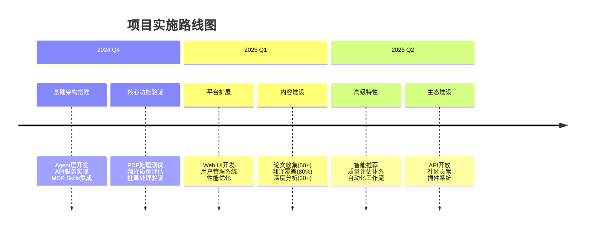
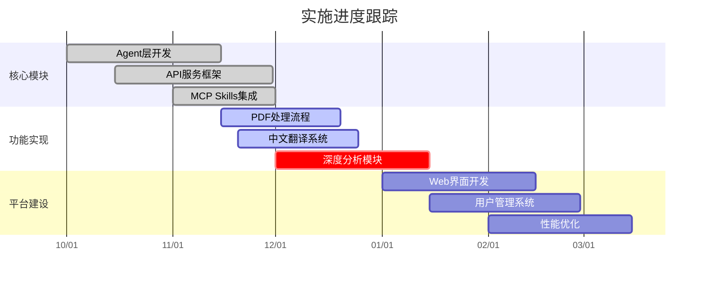

## 📋 实施计划与进度管理

### 实施路线图

### 当前进度跟踪

### 实施注意事项

#### 🎯 核心原则

- **最小可行产品优先**: 先实现核心功能，再扩展高级特性
- **质量优于速度**: 确保翻译质量和系统稳定性
- **迭代式开发**: 快速迭代，持续改进

#### ⚠️ 关键风险与对策

| 风险项       | 影响 | 应对策略                   |
| ------------ | ---- | -------------------------- |
| API 配额限制 | 高   | 实现智能缓存，优化请求策略 |
| 翻译质量控制 | 高   | 建立审核机制，多轮校验     |
| 性能瓶颈     | 中   | 异步处理，批量优化         |
| 数据存储增长 | 中   | 实施压缩策略，云存储方案   |

### 执行清单

#### Phase 1: 核心功能完善 (2024 Q4)

- [ ] 完成所有 Agent 单元测试覆盖率 > 80%
- [ ] 实现 API 文档自动化生成
- [ ] 建立错误监控和日志系统
- [ ] 优化 PDF 处理性能（< 30 秒/篇）
- [ ] 实现翻译质量评分机制

#### Phase 2: 平台扩展 (2025 Q1)

- [ ] 开发响应式 Web UI
- [ ] 实现用户认证和权限管理
- [ ] 建立论文搜索和筛选功能
- [ ] 实现批量导入和处理
- [ ] 添加数据导出功能

#### Phase 3: 生态建设 (2025 Q2)

- [ ] 开放 API 接口和 SDK
- [ ] 建立贡献者奖励机制
- [ ] 实现论文推荐算法
- [ ] 建立社区讨论区
- [ ] 开发浏览器插件

### 进度跟踪指标

#### 技术指标

- **代码覆盖率**: 目标 > 80%
- **API 响应时间**: 目标 < 500ms
- **文档构建时间**: 目标 < 2 分钟
- **系统可用性**: 目标 > 99.5%

#### 内容指标

- **论文收集速度**: 目标 5 篇/周
- **翻译完成率**: 目标 90%
- **质量评分**: 目标 > 4.0/5.0
- **用户活跃度**: 目标 100+ DAU

### 后续建议

1. **技术演进**

   - 探索多模态论文处理能力
   - 集成更多 AI 模型选择
   - 开发移动端应用
   - 实现实时协作功能

2. **内容扩展**

   - 覆盖更多 AI 子领域
   - 建立论文引用网络
   - 添加视频解读内容
   - 开发交互式教程

3. **社区建设**
   - 建立同行评议机制
   - 举办线上研讨会
   - 与高校建立合作
   - 开放数据集供研究
