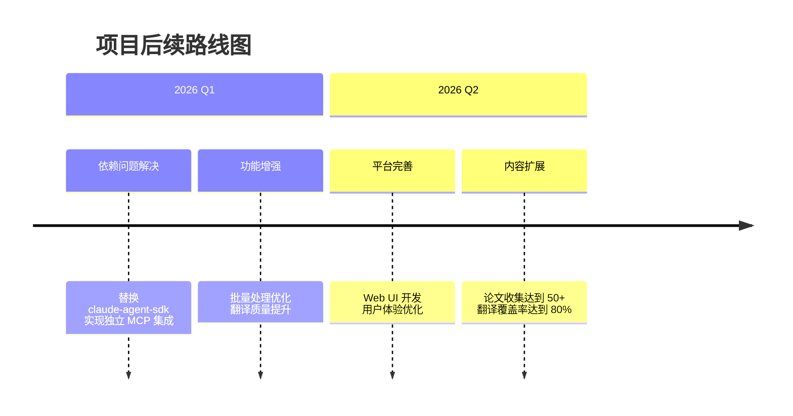

## 📋 项目概述

**Agentic AI 研究论文收集、翻译和管理平台** - 为中文读者提供高质量的 Agentic AI 领域技术资源。

### 当前完成度

- ✅ Agent 层架构（6 个专用 Agent）
- ✅ API 服务（FastAPI）
- ✅ Claude Skills 集成（7 个技能）
- ✅ 基础测试体系（39 个测试文件）
- ✅ CI/CD 流程（GitHub Actions）
- ✅ Docker 部署配置
- ✅ 内容积累（27 篇论文，33 个翻译）

### 实施路线图

### 技术栈与当前限制

#### 已使用技术

- **后端**: Python 3.12+, FastAPI, Pydantic
- **AI 集成**: Claude API, Claude Skills, MCP (Model Context Protocol)
- **数据处理**: pypdf2, pdfplumber, Pillow
- **部署**: Docker, docker-compose, Nginx

#### 当前限制

- ⚠️ claude-agent-sdk 模块缺失，Skill 调用功能暂时不可用
- Web UI 仅有基础静态文件
- 缺少用户认证系统
- 批量处理性能需要优化

### 优先执行任务

#### 立即执行（1-2 周）

- [ ] 解决 claude-agent-sdk 依赖问题
- [ ] 实现独立的 MCP 服务集成
- [ ] 优化批量处理性能
- [ ] 完成剩余论文翻译

#### 短期目标（1 个月）

- [ ] 开发基础 Web UI 界面
- [ ] 实现论文搜索功能
- [ ] 建立翻译质量评估机制
- [ ] 优化 API 响应性能

#### 中期目标（3 个月）

- [ ] 实现用户认证系统
- [ ] 添加论文推荐功能
- [ ] 完善错误处理和日志
- [ ] 提升测试覆盖率至 90%

### 关键指标

#### 当前基线

- **论文总数**: 27 篇
- **翻译完成**: 16 篇（59%）
- **测试覆盖**: 基础测试框架已建立
- **API 响应**: 需要性能优化

#### 目标指标（3 个月内）

- **论文收集**: 目标 50 篇
- **翻译完成率**: 目标 80%
- **API 响应时间**: 目标 < 1 秒
- **系统可用性**: 目标 > 99%
- **测试覆盖率**: 目标 90%

### 后续实施建议

#### 技术优化

1. **依赖解耦**: 移除 claude-agent-sdk 依赖，使用直接 API 调用
2. **性能提升**: 实现异步批处理，添加缓存机制
3. **稳定性**: 增强错误处理，实现重试机制

#### 内容建设

1. **翻译优先**: 完成现有论文的翻译覆盖
2. **质量控制**: 建立翻译质量评分体系
3. **持续更新**: 保持每周 2-3 篇新论文的添加速度

#### 用户体验

1. **基础 UI**: 开发简洁的 Web 管理界面
2. **搜索功能**: 实现基于标题和内容的快速搜索
3. **导出功能**: 支持 Markdown 和 PDF 格式导出
