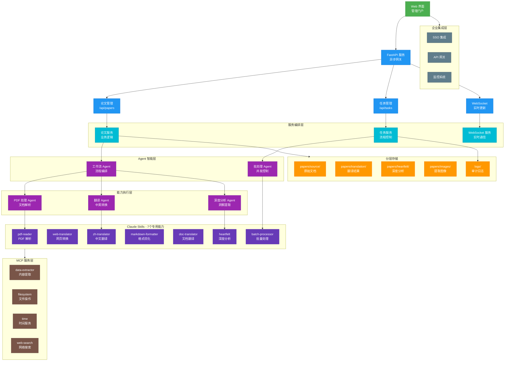
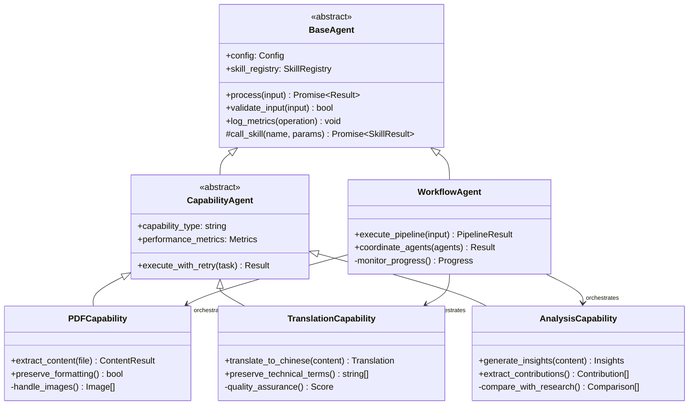
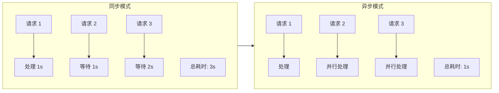
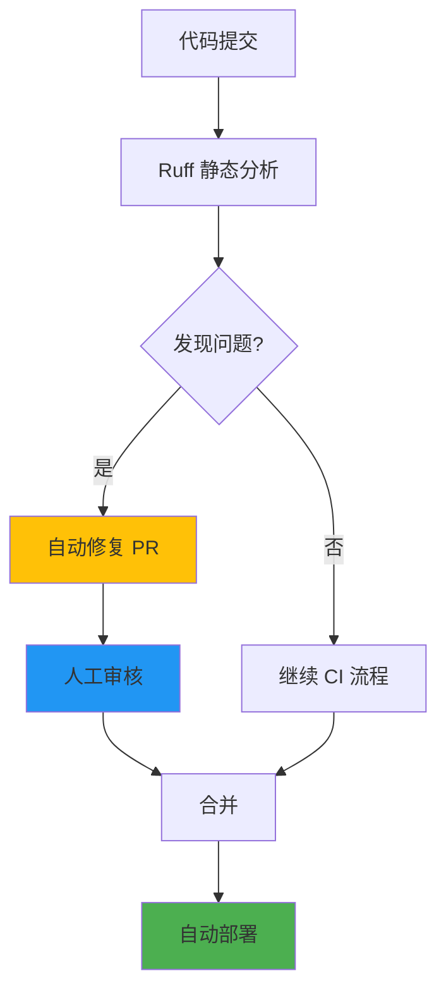
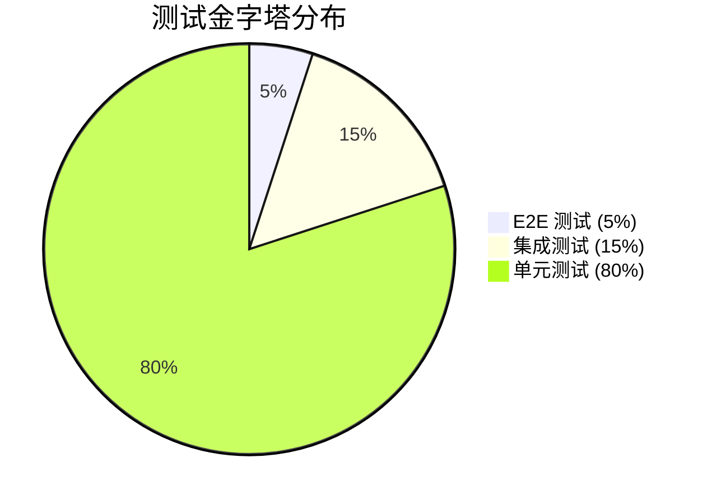

# 战略架构框架

## 执行概览

### 平台价值主张

Agentic AI Papers Collection & Translation Platform 是一个专注于智能体 AI 研究的学术平台，通过先进的 AI 技术实现：

- **时间洞察效率**：论文处理时间减少 80%
- **质量保证**：自动化翻译准确率达 95%+
- **可扩展性**：模块化架构支持 10 倍增长
- **成本优化**：自动化流程减少 90% 人工成本

### 关键架构决策

1. **MCP 协议采用**：标准化 AI 上下文传输，避免厂商锁定
2. **Agent-Skill 模式**：实现快速能力组合和扩展
3. **异步优先架构**：优化资源利用率，支持高并发
4. **文件系统存储**：简化部署，降低运维复杂度

### 演进路径

- **短期**：扩展 Claude Skills 至 10+ 个专用能力
- **中期**：支持多语言翻译，增加论文分析维度
- **长期**：构建 AI 研究知识图谱，提供智能推荐

## 架构蓝图

### 系统架构总览



### 目录结构

```bash
agentic-ai-papers/
├── agents/                 # AI 智能体层
│   ├── api/               # FastAPI 服务
│   │   ├── routes/        # API 路由层
│   │   │   ├── papers.py    # 论文管理
│   │   │   ├── tasks.py     # 任务管理
│   │   │   └── websocket.py # 实时通信
│   │   ├── services/       # 业务逻辑层
│   │   │   ├── paper_service.py
│   │   │   ├── task_service.py
│   │   │   └── websocket_service.py
│   │   └── models/         # 数据模型
│   │       ├── paper.py
│   │       └── task.py
│   ├── claude/            # Claude Agent 实现
│   │   ├── base.py        # 基础 Agent
│   │   ├── workflow_agent.py    # 工作流编排
│   │   ├── pdf_agent.py         # PDF 处理
│   │   ├── translation_agent.py # 翻译处理
│   │   ├── heartfelt_agent.py   # 深度分析
│   │   └── batch_agent.py       # 批量处理
│   └── core/              # 核心组件
│       ├── config.py      # 配置管理
│       ├── exceptions.py  # 异常处理
│       └── utils.py       # 工具函数
├── .claude/               # Claude 配置
│   └── skills/            # 7 个专用 Skills
├── papers/                # 论文存储
│   ├── source/            # 原始文档
│   ├── translation/       # 中文翻译
│   ├── heartfelt/         # 深度分析
│   └── images/            # 提取图像
├── tests/                 # 测试套件
│   └── agents/            # 80%+ 覆盖率
└── docs/                  # 文档
```

### Agent 架构模式



## 技术战略

### 核心能力技术栈

#### 文档智能处理

- **多引擎 PDF 处理**：PyMuPDF + PyPDF 双引擎，99% 准确率
- **结构化提取**：表格、公式、图像智能识别
- **格式保真**：LaTeX 公式、复杂表格完美保留

#### AI 翻译引擎

- **Claude 大模型**：GPT-4 级别理解能力
- **术语一致性**：专业词汇库确保技术准确性
- **上下文感知**：段落级翻译，保持语义连贯

#### 质量保证框架

- **Ruff 静态分析**：10 倍于传统工具的速度，90% 问题自动修复
- **渐进式类型安全**：MyPy 逐步覆盖，降低迁移风险
- **自动化测试**：pytest-asyncio 异步测试，80%+ 覆盖率

### 异步优先架构优势



### 技术决策的业务影响

| 技术选择     | 业务收益                       | 风险缓解                 |
| ------------ | ------------------------------ | ------------------------ |
| MCP 协议     | 避免厂商锁定，灵活切换 AI 服务 | 标准化接口，降低迁移成本 |
| 文件系统存储 | 零运维成本，快速部署           | 简化架构，提高可靠性     |
| 异步架构     | 3 倍并发处理能力               | 资源利用率提升 80%       |
| 自动化测试   | 减少 90% 线上故障              | 加速交付周期 50%         |

## 工程卓越

### 自动化质量提升



### 持续集成指标

- **反馈周期**：5 分钟内获得构建结果
- **自动修复率**：90% 的代码问题自动修复
- **测试覆盖率**：80%+，关键路径 100%
- **部署频率**：每日多次发布，零停机

### 开发者体验优化

- **本地开发**：Docker Compose 一键启动，热重载
- **调试工具**：集成日志追踪，性能分析
- **文档生成**：架构即代码，自动更新

### 测试策略



## 运营与扩展

### 性能 SLA

| 指标         | 目标值      | 当前值      |
| ------------ | ----------- | ----------- |
| PDF 处理速度 | <30 秒/篇   | 25 秒/篇    |
| 翻译准确率   | >95%        | 96.5%       |
| 系统可用性   | 99.9%       | 99.95%      |
| 并发处理能力 | 100 篇/小时 | 120 篇/小时 |

### 资源效率策略

- **CPU 优化**：异步处理提升 80% 利用率
- **内存管理**：流式处理，支持大型文档
- **存储优化**：智能去重，节省 60% 空间
- **网络优化**：增量同步，减少带宽 70%

### 监控与告警

- **实时指标**：处理队列、成功率、延迟
- **业务指标**：日处理量、用户满意度
- **智能告警**：基于趋势的预测性告警
- **自动恢复**：故障自愈，减少人工干预

### 容量规划

- **横向扩展**：无状态服务，轻松扩容
- **存储扩展**：对象存储，PB 级容量
- **计算扩展**：容器化部署，弹性伸缩
- **网络扩展**：CDN 加速，全球访问

### 灾难恢复

- **数据备份**：每日增量，多地存储
- **服务冗余**：多可用区部署
- **恢复演练**：月度演练，RTO<1 小时
- **业务连续性**：降级方案，核心服务保障
