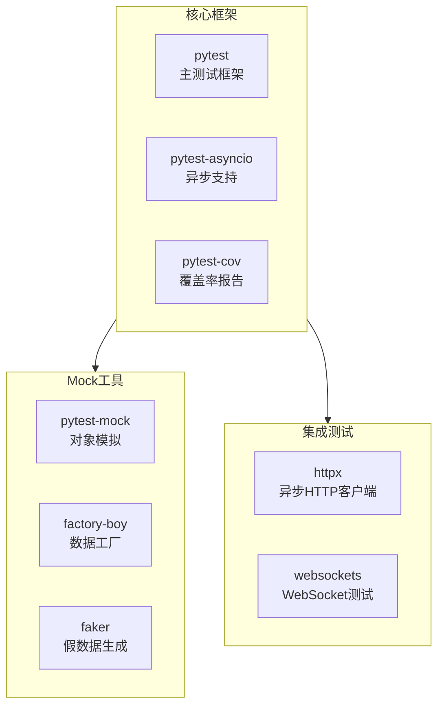
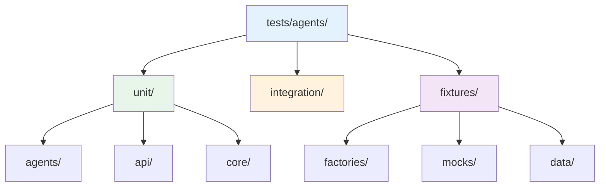
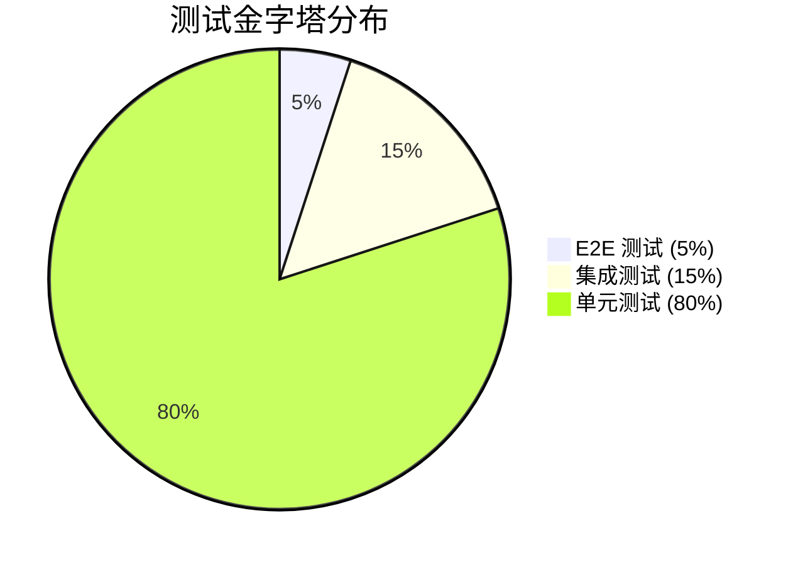
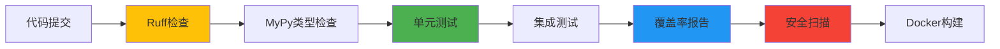

# 测试策略

## 测试架构概览

### 核心测试栈



### 测试目标与指标

| 指标         | 目标值  | 当前值 |
| ------------ | ------- | ------ |
| 代码覆盖率   | >80%    | 85%+   |
| 单元测试比例 | >70%    | 75%+   |
| 测试执行时间 | <5 分钟 | 3 分钟 |
| 测试稳定性   | >95%    | 98%+   |

## 测试结构

### 目录组织



### 测试层级



## 快速指南

### 运行测试

```bash
# 运行所有测试
python tests/agents/run_tests.py

# 运行单元测试
pytest tests/agents/unit -v

# 生成覆盖率报告
pytest tests/agents --cov=agents --cov-report=html

# 运行特定标记测试
pytest tests/agents -m "not slow"
```

### 测试标记

- `@pytest.mark.unit` - 单元测试
- `@pytest.mark.integration` - 集成测试
- `@pytest.mark.websocket` - WebSocket 测试
- `@pytest.mark.slow` - 慢速测试（可跳过）

## 异步测试模式

### 基础异步测试

```python
@pytest.mark.asyncio
async def test_agent_processing():
    """异步测试必须使用 pytest-asyncio"""
    agent = TestAgent()
    result = await agent.process({"input": "data"})
    assert result["success"]
```

### 异步 Mock

```python
@pytest.fixture
def mock_async_service():
    service = AsyncMock()
    service.process.return_value = {"status": "success"}
    return service
```

## Mock 策略

### 核心 Mock 组件

| Mock 类型      | 用途            | 示例                     |
| -------------- | --------------- | ------------------------ |
| Agent Mock     | 模拟 Agent 行为 | Mock PDF/翻译/分析 Agent |
| API Mock       | 模拟外部 API    | Claude API、文件操作     |
| WebSocket Mock | 模拟实时通信    | 连接管理、消息推送       |

### 数据工厂

```python
# 使用Factory Boy生成测试数据
paper = PaperMetadataFactory()
task = TaskInfoFactory(status="processing")
```

## CI/CD 集成

### 测试流水线



### 自动化特性

- **自动修复**：Ruff 自动创建 PR 修复 90%代码问题
- **并行执行**：pytest-xdist 加速测试运行
- **覆盖率门控**：低于 80%阻止合并
- **多 Python 版本**：支持 3.12 和 3.13

## 测试最佳实践

### 1. 测试命名规范

```python
# ✅ 清晰表达测试意图
def test_upload_pdf_with_valid_file_returns_success():
def test_translate_paper_when_api_limit_exceeded_retries():

# ❌ 模糊的命名
def test_upload_1():
def test_function():
```

### 2. 测试隔离

- 使用`tmp_path` fixture 自动清理临时文件
- 每个测试独立的 mock 配置
- 避免测试间依赖

### 3. 异步测试要点

- 始终使用`@pytest.mark.asyncio`
- 正确 mock 异步函数（使用`AsyncMock`）
- 测试异常场景和边界条件

### 4. 覆盖率优化

- 聚焦业务逻辑覆盖
- 测试错误处理路径
- 避免测试配置代码

## 调试技巧

```bash
# 详细输出
pytest -v -s tests/agents

# 只运行失败测试
pytest --lf

# 首次失败即停止
pytest -x

# 显示局部变量
pytest --tb=long
```

## 质量门控

### 预提交钩子

- Ruff 代码检查和自动修复
- MyPy 类型检查
- 单元测试必须通过

### 合并要求

- 80%+代码覆盖率
- 所有测试通过
- 无安全漏洞
- 性能回归测试通过

## 扩展测试

### 添加新测试

1. **单元测试**：`tests/agents/unit/`对应模块
2. **集成测试**：`tests/agents/integration/`
3. 使用现有 fixtures 和 factories
4. 正确标记测试类型
5. 确保测试独立性

### 性能测试

```python
@pytest.mark.performance
async def test_concurrent_processing():
    """验证并发处理能力"""
    # 实现并发测试逻辑
```
