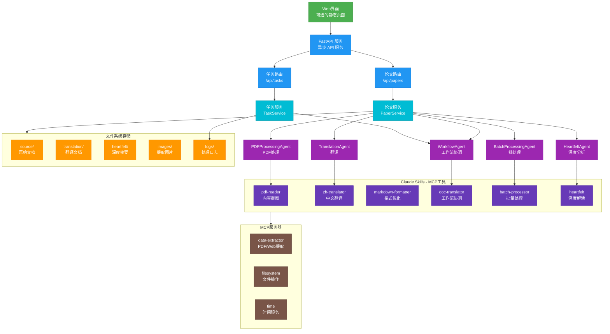
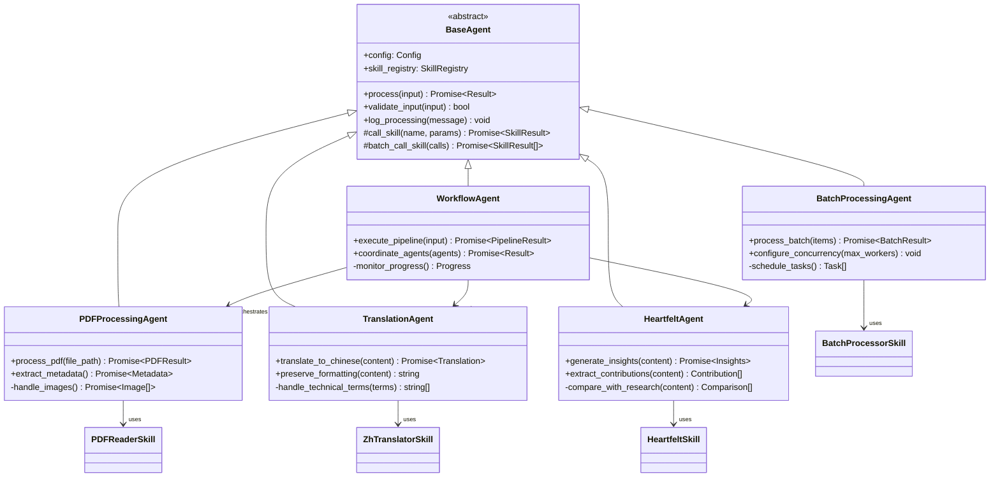
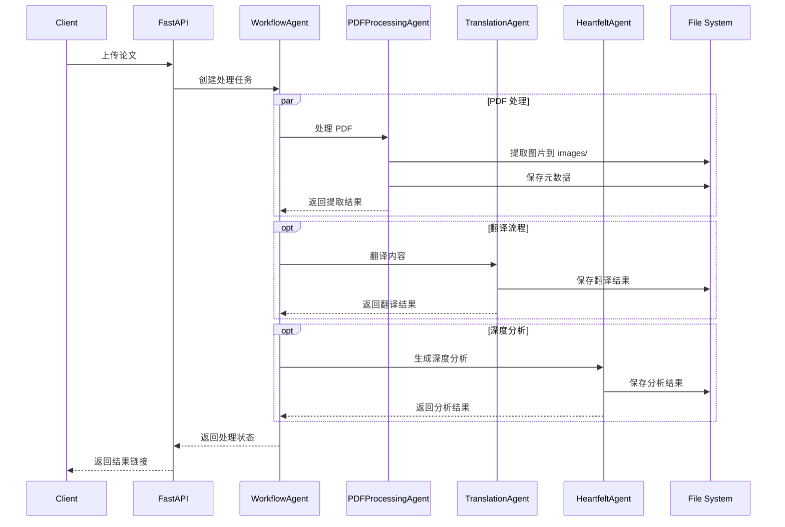
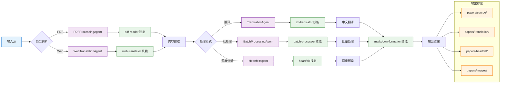
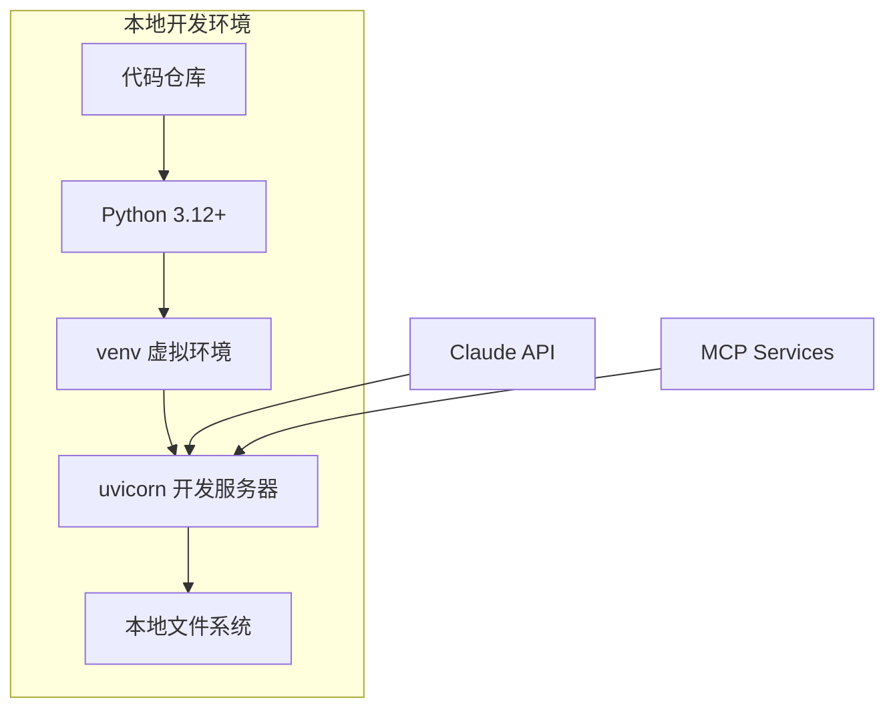
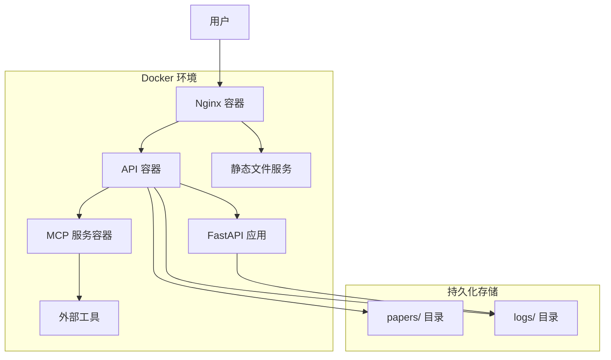

# 架构设计方案

## 项目概述

Agentic AI Papers Collection & Translation Platform 是一个专注于 Agentic AI 研究的学术论文收集、翻译和管理平台，致力于为中文读者提供高质量的人工智能智能体领域技术资源。

### 核心目标

- 📚 **系统性收集**: 全面收集 Agentic AI 领域的重要研究论文
- 🔄 **智能翻译**: 基于 AI 的高质量中文学术翻译
- 🤖 **智能处理**: 使用专门的 Agent 处理学术论文
- 📊 **深度分析**: 提供论文的深度解读和分析

## 仓库结构

```bash
agentic-ai-papers/
├── agents/             # AI 代理实现
│   └── claude/         # 基于 Claude Agent SDK 的代理
│       ├── __init__.py
│       ├── base.py           # Agent 基类
│       ├── workflow_agent.py # 工作流协调器
│       ├── pdf_agent.py      # PDF 处理代理
│       ├── translation_agent.py # 翻译代理
│       ├── heartfelt_agent.py # 深度分析代理
│       └── batch_agent.py    # 批处理代理
├── api/                # FastAPI 服务层
│   ├── main.py        # 应用入口
│   ├── routes/        # API 路由
│   │   ├── papers.py  # 论文管理接口
│   │   ├── tasks.py   # 任务管理接口
│   │   └── websocket.py # WebSocket 接口
│   ├── services/      # 业务逻辑层
│   │   ├── paper_service.py # 论文处理服务
│   │   ├── task_service.py  # 任务管理服务
│   │   └── websocket_service.py # WebSocket 服务
│   └── models/        # 数据模型
│       ├── paper.py   # 论文相关模型
│       └── task.py    # 任务相关模型
├── core/              # 核心配置和工具
│   ├── config.py      # 应用配置
│   ├── exceptions.py  # 异常定义
│   └── utils.py       # 工具函数
├── ui/                # Web UI（可选）
│   ├── index.html     # 主页面
│   └── nginx.conf     # Nginx 配置
├── papers/            # 论文存储
│   ├── source/        # 原始文档 (PDF)
│   ├── images/        # 提取的图片
│   ├── translation/   # 中文翻译 (Markdown)
│   └── heartfelt/     # 深度分析 (Markdown)
├── .claude/           # Claude 配置和 Skills
│   └── skills/        # Claude Skills (7个)
├── logs/              # 日志文件
├── docker-compose.yml # 容器编排配置
├── Dockerfile         # 容器镜像配置
└── pyproject.toml     # 项目依赖配置
```

## 核心功能

### 智能论文处理

- 解析和提取 PDF/Web Page 内容
- 识别和提取数学公式和表格
- 提取图像和图表
- 自动分类和标签

### 高质量翻译

- 保持技术术语准确性
- 保留数学公式格式
- 适应中文表达习惯
- 翻译质量评估

### 深度解读

- 核心贡献总结
- 技术要点分析
- 相关研究对比
- 实践应用建议

## 架构设计

### 系统架构总览



### Agent 层架构

#### Agent 继承关系



### Agent 交互模式



### 文档处理流水线



## 技术栈

### 后端技术

- **Python 3.12+**: 主要编程语言
- **FastAPI**: 高性能异步 Web 框架
- **Claude Agent SDK**: Agent 开发框架
- **Pydantic**: 数据验证和序列化
- **Uvicorn**: ASGI 服务器

### AI 集成

- **Claude API**: 大语言模型服务
- **MCP (Model Context Protocol)**: 模型上下文协议
- **7 个专用 Claude Skills**: 文档处理能力

### 数据处理

- **PDF 处理**: pypdf2, pdfplumber
- **图像处理**: Pillow
- **Markdown**: markdown 库
- **Web 抓取**: beautifulsoup4, lxml

### 部署技术

- **Docker**: 容器化部署
- **Docker Compose**: 服务编排
- **Nginx**: 反向代理（可选）

## 设计原则

### 1. 最小化架构

- 避免过度工程化
- 优先使用现有工具和服务
- 保持架构简单可维护

### 2. 异步优先

- 全异步架构设计
- 非阻塞 I/O 操作
- 高并发处理能力

### 3. 可扩展性

- 模块化的 Agent 设计
- 插件式的 Skill 系统
- 清晰的接口定义

### 4. 容错性

- 优雅的错误处理
- 重试机制
- 详细的日志记录

## 部署架构

### 开发环境



### 生产环境



## 工程实施策略

### 精简实施原则

1. **利用现有生态**: 充分利用 Claude Skills 的现有能力
2. **渐进式开发**: 从核心功能开始，逐步扩展
3. **本地优先**: 优先支持本地开发和部署
4. **文件系统存储**: 避免引入重型数据库依赖

### 实施阶段

1. **Agent SDK 集成**: 封装现有 Skills 为标准化 Agent
2. **API 服务构建**: 实现轻量级 RESTful API
3. **UI 界面**: 可选的简单 Web 界面
4. **部署优化**: 精简的容器化部署方案

## 性能考虑

### 并发处理

- 使用异步 I/O 提高并发能力
- 批处理 Agent 支持多任务并行
- 合理的资源限制和队列管理

### 缓存策略

- 技能调用结果缓存
- 文件处理状态缓存
- API 响应缓存

### 资源管理

- 内存使用优化
- 临时文件清理
- 长时间任务的资源释放
