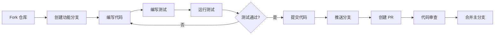

# 开发与维护手册

## 开发环境设置

### 环境要求

- Python 3.12 或更高版本
- Git
- Docker & Docker Compose（可选，用于容器化开发）
- Claude API Key
- 代码编辑器（推荐 VS Code）

### 本地开发设置

#### 1. 克隆仓库

```bash
git clone https://github.com/ThreeFish-AI/agentic-ai-papers.git
cd agentic-ai-papers
```

#### 2. 创建虚拟环境

```bash
# 使用 venv
python -m venv venv
source venv/bin/activate  # Linux/Mac
# 或 venv\Scripts\activate  # Windows

# 或使用 conda
conda create -n agentic-papers python=3.12
conda activate agentic-papers
```

#### 3. 安装依赖

```bash
# 安装核心依赖
pip install -e .

# 安装开发依赖
pip install -e ".[dev]"

# 或使用 uv（更快的包管理器）
uv pip install -e ".[dev]"
```

#### 4. 配置环境变量

```bash
# 复制环境变量模板
cp .env.example .env

# 编辑 .env 文件
nano .env
```

必要的环境变量：

```env
ANTHROPIC_API_KEY=your_claude_api_key_here
# 可选配置
LOG_LEVEL=INFO
MAX_CONCURRENT_TASKS=5
PAPERS_DIR=./papers
```

#### 5. 启动开发服务器

```bash
# 启动 API 服务器
uvicorn agents.api.main:app --reload --host 0.0.0.0 --port 8000
```

### Docker 开发环境

#### 使用 Docker Compose

```bash
# 启动开发环境
docker-compose up

# 后台运行
docker-compose up -d

# 启动包含 UI 的完整环境
docker-compose --profile ui up

# 查看日志
docker-compose logs -f
```

## 代码组织原则

### 目录结构规范

```
agents/
├── claude/              # Claude Agent 实现
│   ├── __init__.py     # 包初始化
│   ├── base.py         # 基础 Agent 类
│   ├── *.py            # 具体实现
├── api/                # FastAPI 服务
│   ├── __init__.py
│   ├── main.py         # 应用入口
│   ├── routes/         # 路由模块
│   ├── services/       # 业务逻辑
│   └── models/         # 数据模型
└── core/               # 核心工具
    ├── config.py       # 配置管理
    ├── exceptions.py   # 异常定义
    └── utils.py        # 通用工具
```

### 命名规范

- **文件名**: 使用小写字母和下划线 (`snake_case`)
- **类名**: 使用大驼峰命名 (`PascalCase`)
- **函数/变量**: 使用小写字母和下划线 (`snake_case`)
- **常量**: 使用大写字母和下划线 (`UPPER_CASE`)
- **私有成员**: 前缀单下划线 (`_private`)

### 导入规范

```python
# 标准库导入
import os
import asyncio
from pathlib import Path
from typing import Optional, Dict, List

# 第三方库导入
import aiofiles
from fastapi import FastAPI, HTTPException
from pydantic import BaseModel

# 本地模块导入
from agents.claude.base import BaseAgent
from agents.core.config import settings
from agents.api.models.paper import Paper
```

### 代码质量保证

我们使用 **Ruff** 作为 Python 代码检查和格式化工具，并设置了自动化修复流程：

#### 自动修复功能

- 🤖 **自动检测**: 当推送代码到任何分支时，自动运行 ruff 检查
- 🔧 **自动修复**: 可自动修复的问题会被直接修复并创建 PR
- 📝 **清晰报告**: 在 GitHub Actions 摘要中详细说明修复的内容

#### 通知机制（可选）

项目支持多种通知方式来接收自动修复的结果：

- **GitHub Actions Step Summary**: 始终显示运行结果
- **Slack 通知**: 通过 Webhook 发送到 Slack 频道
- **邮件通知**: 发送详细的修复报告到指定邮箱

##### 配置通知

在仓库设置中配置以下变量即可启用通知：

1. **启用通知**:

   ```yaml
   NOTIFICATION_ENABLED=true
   ```

2. **Slack 通知**:

   - 添加 Secret: `SLACK_WEBHOOK_URL` (你的 Slack Webhook URL)

3. **邮件通知**:
   - 添加 Variables:
     - `EMAIL_NOTIFICATIONS`: 接收通知的邮箱地址（多个用逗号分隔）
     - `SMTP_SERVER`: SMTP 服务器地址（默认: smtp.gmail.com）
     - `SMTP_PORT`: SMTP 端口（默认: 587）
   - 添加 Secrets:
     - `EMAIL_USERNAME`: SMTP 用户名
     - `EMAIL_PASSWORD`: SMTP 密码
     - `EMAIL_FROM`: 发件人邮箱（可选）

#### 工作流说明

- 自动修复工作流会在所有分支的 Push 时运行
- 修复 PR 会自动添加 `auto-fix` 和 `ruff` 标签
- 所有修复都会经过完整的 CI 测试流程

#### 本地开发建议

```bash
# 安装开发依赖
pip install -e ".[dev]"

# 检查代码问题
ruff check .

# 自动修复可修复的问题
ruff check --fix .

# 格式化代码
ruff format .
```


## Agent 开发指南

### 创建新 Agent

#### 1. 继承 BaseAgent

```python
from agents.claude.base import BaseAgent
from typing import Dict, Any

class CustomAgent(BaseAgent):
    """自定义 Agent 实现"""

    def __init__(self, config: Dict[str, Any]):
        super().__init__(config)
        self.agent_name = "custom"
        self.required_skills = ["skill1", "skill2"]

    async def process(self, input_data: Dict[str, Any]) -> Dict[str, Any]:
        """处理输入数据"""
        # 验证输入
        if not self.validate_input(input_data):
            raise ValueError("Invalid input")

        # 调用技能
        result = await self.call_skill("skill1", input_data)

        # 处理结果
        processed = self._process_result(result)

        return {"success": True, "data": processed}

    def validate_input(self, input_data: Dict[str, Any]) -> bool:
        """验证输入数据"""
        required_fields = ["field1", "field2"]
        return all(field in input_data for field in required_fields)

    def _process_result(self, result: Dict[str, Any]) -> Dict[str, Any]:
        """处理技能结果"""
        # 自定义处理逻辑
        return result
```

#### 2. Agent 配置

```python
# 在 agents/core/config.py 中添加配置
class CustomAgentConfig(BaseSettings):
    enabled: bool = True
    max_retries: int = 3
    timeout: int = 30

    class Config:
        env_prefix = "CUSTOM_AGENT_"
```

#### 3. 注册 Agent

```python
# 在 agents/claude/__init__.py 中注册
from .custom_agent import CustomAgent

AVAILABLE_AGENTS = {
    "custom": CustomAgent,
    # ... 其他 agents
}
```

### 最佳实践

#### 1. 错误处理

```python
async def process(self, input_data: Dict[str, Any]) -> Dict[str, Any]:
    try:
        # 处理逻辑
        result = await self.call_skill("skill", input_data)
        return {"success": True, "data": result}

    except SkillTimeoutError as e:
        self.log_processing(f"Skill timeout: {e}")
        return {"success": False, "error": "Processing timeout"}

    except ValidationError as e:
        self.log_processing(f"Validation error: {e}")
        raise

    except Exception as e:
        self.log_processing(f"Unexpected error: {e}")
        raise ProcessingError(f"Failed to process: {e}")
```

#### 2. 日志记录

```python
import logging

logger = logging.getLogger(__name__)

class CustomAgent(BaseAgent):
    async def process(self, input_data):
        logger.info(f"Processing {len(input_data)} items")

        try:
            result = await self._do_process(input_data)
            logger.info(f"Successfully processed {result['count']} items")
            return result
        except Exception as e:
            logger.error(f"Processing failed: {e}", exc_info=True)
            raise
```

#### 3. 异步编程

```python
# 使用 asyncio 进行并发处理
async def process_batch(self, items: List[Dict]) -> List[Dict]:
    """批量处理"""
    semaphore = asyncio.Semaphore(self.max_concurrent)

    async def process_with_limit(item):
        async with semaphore:
            return await self.process(item)

    tasks = [process_with_limit(item) for item in items]
    results = await asyncio.gather(*tasks, return_exceptions=True)

    return results
```

## API 开发模式

### FastAPI 应用结构

#### 1. 路由定义

```python
# agents/api/routes/custom.py
from fastapi import APIRouter, Depends, HTTPException
from agents.api.services.custom_service import CustomService
from agents.api.models.custom import CustomRequest, CustomResponse

router = APIRouter(prefix="/api/custom", tags=["custom"])

@router.post("/process", response_model=CustomResponse)
async def process_data(
    request: CustomRequest,
    service: CustomService = Depends()
) -> CustomResponse:
    """处理自定义数据"""
    try:
        result = await service.process(request.data)
        return CustomResponse(success=True, data=result)
    except Exception as e:
        raise HTTPException(status_code=500, detail=str(e))
```

#### 2. 服务层

```python
# agents/api/services/custom_service.py
from agents.claude.custom_agent import CustomAgent
from agents.core.config import settings

class CustomService:
    def __init__(self):
        self.agent = CustomAgent(settings.custom_agent_config)

    async def process(self, data: Dict) -> Dict:
        """处理数据"""
        result = await self.agent.process(data)
        return result
```

#### 3. 数据模型

```python
# agents/api/models/custom.py
from pydantic import BaseModel, Field
from typing import Optional, Dict, Any

class CustomRequest(BaseModel):
    data: Dict[str, Any] = Field(..., description="处理数据")
    options: Optional[Dict[str, Any]] = Field(default=None, description="选项")

class CustomResponse(BaseModel):
    success: bool = Field(..., description="是否成功")
    data: Optional[Dict[str, Any]] = Field(default=None, description="结果数据")
    error: Optional[str] = Field(default=None, description="错误信息")
```

### API 最佳实践

#### 1. 依赖注入

```python
from fastapi import Depends

def get_current_user():
    """获取当前用户"""
    # 认证逻辑
    return user

@router.get("/protected")
async def protected_route(user=Depends(get_current_user)):
    return {"message": f"Hello {user}"}
```

#### 4. WebSocket 支持

```python
# agents/api/routes/websocket.py
from fastapi import WebSocket, WebSocketDisconnect
from typing import List

class ConnectionManager:
    def __init__(self):
        self.active_connections: List[WebSocket] = []

    async def connect(self, websocket: WebSocket):
        await websocket.accept()
        self.active_connections.append(websocket)

    async def disconnect(self, websocket: WebSocket):
        self.active_connections.remove(websocket)

    async def send_message(self, message: str, websocket: WebSocket):
        await websocket.send_text(message)

    async def broadcast(self, message: str):
        for connection in self.active_connections:
            await connection.send_text(message)

manager = ConnectionManager()

@router.websocket("/ws")
async def websocket_endpoint(websocket: WebSocket):
    await manager.connect(websocket)
    try:
        while True:
            data = await websocket.receive_text()
            await manager.send_message(f"Received: {data}", websocket)
    except WebSocketDisconnect:
        await manager.disconnect(websocket)
```

#### 5. 中间件使用

```python
# agents/api/main.py
from fastapi import FastAPI
from fastapi.middleware.cors import CORSMiddleware

app = FastAPI()

# CORS 中间件
app.add_middleware(
    CORSMiddleware,
    allow_origins=["*"],
    allow_credentials=True,
    allow_methods=["*"],
    allow_headers=["*"],
)

# 自定义中间件
@app.middleware("http")
async def log_requests(request, call_next):
    logger.info(f"Request: {request.method} {request.url}")
    response = await call_next(request)
    logger.info(f"Response: {response.status_code}")
    return response
```

## 测试策略

### 测试框架配置

项目使用 `pytest` 作为测试框架，配置如下：

```toml
# pyproject.toml
[tool.pytest.ini_options]
minversion = "7.0"
addopts = "-ra -q --strict-markers --strict-config"
testpaths = ["tests"]
markers = [
    "slow: marks tests as slow",
    "integration: marks tests as integration",
    "unit: marks tests as unit"
]
```

### 测试结构

```
tests/agents/
├── unit/               # 单元测试
│   ├── agents/
│   ├── api/
│   └── core/
├── integration/        # 集成测试
│   ├── workflows/
│   └── endpoints/
├── fixtures/           # 测试数据
│   ├── factories/
│   └── mocks/
└── conftest.py         # 测试配置
```

### 单元测试示例

```python
# tests/agents/unit/agents/test_custom_agent.py
import pytest
from agents.claude.custom_agent import CustomAgent

@pytest.fixture
def custom_agent():
    config = {"max_retries": 3}
    return CustomAgent(config)

@pytest.mark.asyncio
async def test_process_success(custom_agent):
    """测试成功处理"""
    input_data = {"field1": "value1", "field2": "value2"}

    result = await custom_agent.process(input_data)

    assert result["success"] is True
    assert "data" in result

@pytest.mark.asyncio
async def test_process_invalid_input(custom_agent):
    """测试无效输入"""
    input_data = {"field1": "value1"}  # 缺少 field2

    with pytest.raises(ValueError):
        await custom_agent.process(input_data)
```

### Mock 策略

```python
# tests/conftest.py
import pytest
from unittest.mock import AsyncMock, patch

@pytest.fixture
def mock_skill():
    """Mock 技能调用"""
    async def mock_call(name, params):
        return {"result": f"mocked_{name}_result"}

    with patch("agents.claude.base.BaseAgent.call_skill", mock_call):
        yield

@pytest.fixture
def sample_pdf():
    """提供示例 PDF 文件路径"""
    return "tests/fixtures/sample_papers/sample.pdf"
```

## MCP 开发

### MCP (Model Context Protocol) 集成

项目使用 MCP 工具来扩展 Claude 的能力，包括：

#### 可用的 MCP 工具

- **pdf-reader**: PDF 文档解析和内容提取
- **zh-translator**: 中文学术文档翻译
- **web-translator**: 网页内容抓取和转换
- **data-extractor**: 数据提取和网页抓取
- **batch-processor**: 批量文档处理

#### MCP 配置

MCP 工具配置位于 `.claude/` 目录：

```yaml
# .claude/claude_desktop_config.json
{
  "mcpServers": {
    "data-extractor": {
      "command": "mcp-data-extractor",
      "args": []
    }
  }
}
```

#### 在 Agent 中使用 MCP 技能

```python
from agents.claude.base import BaseAgent

class PDFProcessingAgent(BaseAgent):
    def __init__(self, config):
        super().__init__(config)
        self.required_skills = ["pdf-reader", "zh-translator"]

    async def process_paper(self, pdf_path: str) -> dict:
        # 使用 PDF 读取技能
        result = await self.call_skill("pdf-reader", {"file_path": pdf_path})

        # 使用翻译技能
        if result.get("success"):
            translated = await self.call_skill(
                "zh-translator",
                {"content": result["content"]}
            )
            return translated

        return result
```

## 调试和故障排除

### 日志配置

```python
# agents/core/logging.py
import logging

logging.basicConfig(
    level=logging.INFO,
    format="%(asctime)s - %(name)s - %(levelname)s - %(message)s"
)
```

### 常见问题

1. **Agent 无法启动**: 检查 API Key 配置和 MCP 工具是否安装
2. **技能调用失败**: 验证技能名称和参数格式
3. **性能问题**: 使用 `ruff` 分析代码，检查异步操作

### 性能分析

```python
import time
from functools import wraps

def timing_decorator(func):
    @wraps(func)
    async def wrapper(*args, **kwargs):
        start = time.time()
        result = await func(*args, **kwargs)
        print(f"{func.__name__} took {time.time() - start:.2f}s")
        return result
    return wrapper
```

## 安全考虑

### API 安全

- **API Key 管理**: 使用环境变量存储敏感信息
- **输入验证**: 对所有用户输入进行验证和清理
- **文件安全**: 限制上传文件类型和大小
- **访问控制**: 实施适当的认证和授权

### 数据保护

```python
# 敏感数据保护示例
import os
from cryptography.fernet import Fernet

class SecureConfig:
    def __init__(self):
        self.key = os.environ.get("ENCRYPTION_KEY")
        self.cipher = Fernet(self.key.encode())

    def encrypt_api_key(self, api_key: str) -> str:
        return self.cipher.encrypt(api_key.encode()).decode()

    def decrypt_api_key(self, encrypted_key: str) -> str:
        return self.cipher.decrypt(encrypted_key.encode()).decode()
```

### 最佳实践

- 定期更新依赖包
- 使用 HTTPS 进行通信
- 实施日志审计
- 定期进行安全审查

## 贡献指南

### 开发流程



### 提交规范

使用 [Conventional Commits](https://www.conventionalcommits.org/) 规范：

```
feat: 添加新功能
fix: 修复 bug
docs: 更新文档
style: 代码格式调整
refactor: 代码重构
test: 添加或修改测试
chore: 构建过程或辅助工具的变动
```

示例：

```bash
git commit -m "feat(agent): 添加新的翻译 Agent"
git commit -m "fix(api): 修复文件上传的内存泄漏问题"
```

### 代码审查清单

- [ ] 代码符合项目编码规范
- [ ] 包含必要的单元测试
- [ ] 文档已更新
- [ ] 没有硬编码的配置
- [ ] 错误处理完善
- [ ] 日志记录合理
- [ ] 性能影响已评估

## 发布流程

### 版本管理

使用语义化版本 (SemVer)：

- **主版本号**：不兼容的 API 修改
- **次版本号**：向下兼容的功能性新增
- **修订号**：向下兼容的问题修正

### 发布步骤

1. **更新版本号**

```bash
# 更新 pyproject.toml
version = "1.1.0"

# 更新 API 版本（如果需要）
```

2. **更新 CHANGELOG**

```markdown
# 更新日志

## [1.1.0] - 2024-01-15

### 新增

- 添加批量处理功能
- 支持更多文档格式

### 修复

- 修复 PDF 解码问题
```

3. **创建发布标签**

```bash
git tag -a v1.1.0 -m "Release version 1.1.0"
git push origin v1.1.0
```

4. **构建和发布**

```bash
# 构建 Docker 镜像
docker build -t agentic-ai-papers:v1.1.0 .

# 发布到 PyPI（可选）
python -m build
twine upload dist/*
```

## 性能优化

### 关键优化点

1. **并发处理**: 使用 `asyncio.Semaphore` 限制并发数
2. **缓存机制**: 使用 `functools.lru_cache` 缓存频繁访问的数据
3. **响应压缩**: 添加 `GZipMiddleware` 减少传输大小
4. **异步操作**: 确保所有 I/O 操作都是异步的

## 维护与监控

### 定期维护
- 每日检查错误日志
- 每周更新依赖包
- 每月清理临时文件
- 定期备份 `papers/` 目录

### 监控要点
- API 响应时间
- 错误率
- 内存和磁盘使用

### 应急响应
1. 监控告警 → 2. 定位问题 → 3. 实施修复 → 4. 复盘改进
