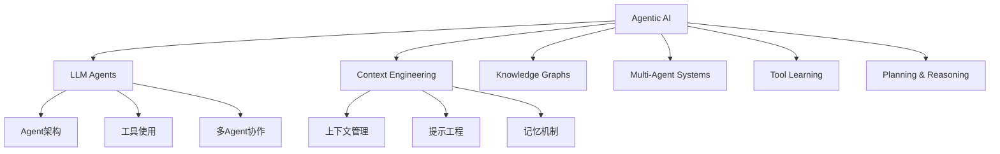

# 用户使用手册

## 快速开始

### 环境要求

- Python 3.12+
- Docker & Docker Compose（可选）
- Claude API Key

### 安装方式

#### 方式一：Docker Compose 部署（推荐）

```bash
# 1. 克隆仓库
git clone https://github.com/ThreeFish-AI/agentic-ai-papers.git
cd agentic-ai-papers

# 2. 配置环境变量
cp .env.example .env
# 编辑 .env 文件，添加 ANTHROPIC_API_KEY

# 3. 启动服务
docker-compose up -d

# 4. 验证服务
curl http://localhost:8000/health
```

#### 方式二：本地开发安装

```bash
# 1. 克隆仓库并进入目录
git clone https://github.com/ThreeFish-AI/agentic-ai-papers.git
cd agentic-ai-papers

# 2. 创建虚拟环境
python -m venv venv
source venv/bin/activate  # Linux/Mac
# 或 venv\Scripts\activate  # Windows

# 3. 安装依赖
pip install -e .

# 4. 启动服务
uvicorn api.main:app --reload --host 0.0.0.0 --port 8000
```

### 验证安装

访问以下 URL 验证服务是否正常运行：

- API 文档：http://localhost:8000/docs
- 健康检查：http://localhost:8000/health

## 使用方式

### 1. API 接口使用

#### 上传论文

```bash
# 使用 curl 上传
curl -X POST "http://localhost:8000/api/papers/upload" \
  -H "accept: application/json" \
  -H "Content-Type: multipart/form-data" \
  -F "file=@example.pdf" \
  -F "category=llm-agents"

# 响应示例
{
  "id": "paper_123",
  "filename": "example.pdf",
  "status": "uploaded",
  "path": "papers/source/llm-agents/example.pdf"
}
```

#### 处理论文

```bash
# 触发翻译
curl -X POST "http://localhost:8000/api/papers/paper_123/translate" \
  -H "accept: application/json"

# 触发深度分析
curl -X POST "http://localhost:8000/api/papers/paper_123/analyze" \
  -H "accept: application/json"
```

#### 查询状态

```bash
# 查询论文状态
curl "http://localhost:8000/api/papers/paper_123"

# 查询任务状态
curl "http://localhost:8000/api/tasks/task_456"
```

### 2. Web UI 使用

启用 Web UI：

```bash
# 使用 Docker Compose 启动 UI
docker-compose --profile ui up -d

# 访问 UI
open http://localhost:3000
```

Web UI 功能：

- **文件上传**：拖拽或选择 PDF 文件上传
- **论文管理**：查看、分类、搜索论文
- **处理进度**：实时查看翻译和分析进度
- **结果查看**：在线浏览翻译结果和分析报告

### 3. 直接文件系统操作

适用于高级用户和自动化脚本：

```bash
# 1. 将 PDF 放入对应目录
mkdir -p papers/source/llm-agents
cp my-paper.pdf papers/source/llm-agents/

# 2. 文件监控会自动检测新文件
# 3. 处理结果会自动保存到对应目录
#    - 翻译：papers/translation/llm-agents/my-paper.md
#    - 分析：papers/heartfelt/llm-agents/my-paper.md
#    - 图片：papers/images/llm-agents/
```

## 详细操作指南

### 添加新论文完整流程

#### 步骤 1：准备论文文件

支持的文件格式：

- PDF 文档（推荐）
- 网页链接（通过 API）

#### 步骤 2：选择分类

支持的论文分类：



#### 步骤 3：上传论文

**Python SDK 示例**：

```python
import requests

# 上传论文
files = {'file': open('paper.pdf', 'rb')}
data = {'category': 'llm-agents'}
response = requests.post(
    'http://localhost:8000/api/papers/upload',
    files=files,
    data=data
)
paper_id = response.json()['id']

# 开始翻译
requests.post(f'http://localhost:8000/api/papers/{paper_id}/translate')

# 开始深度分析
requests.post(f'http://localhost:8000/api/papers/{paper_id}/analyze')
```

#### 步骤 4：监控处理进度

```python
import time

def check_progress(paper_id):
    response = requests.get(f'http://localhost:8000/api/papers/{paper_id}')
    return response.json()

# 轮询检查
while True:
    status = check_progress(paper_id)
    print(f"Status: {status['status']}")

    if status['status'] == 'completed':
        print("处理完成！")
        break

    time.sleep(5)
```

#### 步骤 5：获取结果

```python
# 获取翻译结果
response = requests.get(f'http://localhost:8000/api/papers/{paper_id}/translation')
translation = response.json()['content']

# 获取分析结果
response = requests.get(f'http://localhost:8000/api/papers/{paper_id}/analysis')
analysis = response.json()['content']

# 下载文件
translation_url = f'http://localhost:8000/api/papers/{paper_id}/download/translation'
analysis_url = f'http://localhost:8000/api/papers/{paper_id}/download/analysis'

requests.get(translation_url)  # 下载翻译的 Markdown 文件
requests.get(analysis_url)     # 下载分析报告
```

### 批量处理

#### 批量上传

```python
import os
import requests

def batch_upload(directory, category):
    """批量上传目录中的所有 PDF"""
    uploaded = []

    for filename in os.listdir(directory):
        if filename.endswith('.pdf'):
            filepath = os.path.join(directory, filename)

            with open(filepath, 'rb') as f:
                files = {'file': f}
                data = {'category': category}
                response = requests.post(
                    'http://localhost:8000/api/papers/upload',
                    files=files,
                    data=data
                )

            uploaded.append(response.json()['id'])
            print(f"Uploaded {filename}: {response.json()['id']}")

    return uploaded

# 使用示例
paper_ids = batch_upload('./my-papers', 'llm-agents')
```

#### 批量处理 API

```bash
# 创建批量任务
curl -X POST "http://localhost:8000/api/tasks/batch" \
  -H "Content-Type: application/json" \
  -d '{
    "paper_ids": ["paper_1", "paper_2", "paper_3"],
    "operations": ["translate", "analyze"]
  }'
```

### 高级功能

#### 自定义翻译选项

```python
# 上传时指定翻译选项
data = {
    'category': 'llm-agents',
    'translation_options': {
        'preserve_formulas': True,
        'technical_mode': True,
        'target_style': 'academic'
    }
}
```

#### 增量更新

```bash
# 只翻译新增内容
curl -X POST "http://localhost:8000/api/papers/paper_123/translate" \
  -H "Content-Type: application/json" \
  -d '{"incremental": true}'
```

#### 导出功能

```bash
# 导出所有翻译
curl "http://localhost:8000/api/export/translations?format=zip"

# 导出特定分类
curl "http://localhost:8000/api/export/translations?category=llm-agents"
```

## 常见问题

### Q1: 上传失败怎么办？

**可能原因**：

- 文件大小超过限制（默认 100MB）
- 文件格式不支持
- API Key 未配置或无效

**解决方案**：

```bash
# 检查 API Key
curl "http://localhost:8000/api/config/validate"

# 压缩大文件
gs -sDEVICE=pdfwrite -dCompatibilityLevel=1.4 -dPDFSETTINGS=/printer \
   -dNOPAUSE -dQUIET -dBATCH -sOutputFile=compressed.pdf input.pdf

# 转换格式
# 如果是图片 PDF，使用 OCR 工具预处理
```

### Q2: 处理速度慢如何优化？

**优化方案**：

1. **启用批处理模式**

```bash
curl -X POST "http://localhost:8000/api/papers/paper_123/translate" \
  -d '{"batch_mode": true}'
```

2. **调整并发数**

```env
# .env 文件
MAX_CONCURRENT_TASKS=10
```

3. **使用本地缓存**

```env
ENABLE_CACHE=true
CACHE_TTL=3600
```

### Q3: 翻译质量不理想？

**改进方法**：

1. **提供术语表**

```python
terminology = {
    "Agent": "智能体",
    "LLM": "大语言模型",
    # 自定义术语
}
```

2. **选择翻译风格**

```python
styles = {
    "academic": "学术风格",
    "technical": "技术文档风格",
    "casual": "通俗风格"
}
```

3. **使用增量翻译**

```bash
# 先翻译摘要，确认质量后再翻译全文
curl -X POST "http://localhost:8000/api/papers/paper_123/translate" \
  -d '{"sections": ["abstract"]}'
```

### Q4: 如何处理公式和图片？

**自动处理**：

- 公式会被自动识别并保留 LaTeX 格式
- 图片会被提取并保存到 `papers/images/` 目录
- 在 Markdown 中会有相应的引用

**手动调整**：

```markdown
<!-- 公式示例 -->

$$
E = mc^2
$$

<!-- 图片引用示例 -->


```

### Q5: 如何备份和恢复数据？

**备份方案**：

```bash
# 完整备份
tar -czf backup_$(date +%Y%m%d).tar.gz papers/ logs/ .env

# 只备份论文数据
tar -czf papers_backup_$(date +%Y%m%d).tar.gz papers/

# 使用脚本自动备份
#!/bin/bash
BACKUP_DIR="/backup/agentic-papers"
DATE=$(date +%Y%m%d)
mkdir -p $BACKUP_DIR
tar -czf $BACKUP_DIR/papers_$DATE.tar.gz papers/
```

**恢复方案**：

```bash
# 恢复数据
tar -xzf backup_20240115.tar.gz -C ./

# 验证数据完整性
curl "http://localhost:8000/api/papers/list"
```

## 最佳实践

### 1. 论文组织建议

```
papers/
├── source/
│   ├── llm-agents/
│   │   ├── 2024/
│   │   └── 2023/
│   ├── context-engineering/
│   └── multi-agent/
├── translation/
│   └── [保持与 source 相同结构]
└── heartfelt/
    └── [保持与 source 相同结构]
```

### 2. 命名规范

- 使用有意义的文件名：`paper_name_author_year.pdf`
- 避免特殊字符和空格
- 包含年份便于排序

### 3. 元数据管理

```python
# 在论文目录创建 metadata.json
{
    "title": "Attention Is All You Need",
    "authors": ["Vaswani, A.", "Shazeer, N."],
    "year": 2017,
    "venue": "NeurIPS",
    "tags": ["transformer", "attention", "nlp"],
    "notes": "里程碑式的论文，提出了 Transformer 架构"
}
```

### 4. 定期维护

- 每周检查新增论文
- 定期清理临时文件
- 更新分类标签
- 备份重要数据

## API 参考

### 认证

```bash
# 使用 API Key（如果启用）
curl -H "Authorization: Bearer YOUR_API_KEY" \
  "http://localhost:8000/api/papers"
```

### 端点列表

| 方法 | 端点                               | 描述         |
| ---- | ---------------------------------- | ------------ |
| POST | `/api/papers/upload`               | 上传论文     |
| GET  | `/api/papers/{id}`                 | 获取论文信息 |
| POST | `/api/papers/{id}/translate`       | 翻译论文     |
| POST | `/api/papers/{id}/analyze`         | 分析论文     |
| GET  | `/api/papers/{id}/download/{type}` | 下载结果     |
| GET  | `/api/tasks/{id}`                  | 获取任务状态 |
| POST | `/api/tasks/batch`                 | 批量处理     |
| GET  | `/api/export/{type}`               | 导出数据     |
| GET  | `/api/search`                      | 搜索论文     |

### WebSocket 实时更新

```javascript
// 连接 WebSocket
const ws = new WebSocket("ws://localhost:8000/ws/progress");

ws.onmessage = (event) => {
  const data = JSON.parse(event.data);
  console.log(`任务 ${data.task_id} 进度: ${data.progress}%`);
};

// 订阅特定任务
ws.send(
  JSON.stringify({
    action: "subscribe",
    task_id: "paper_123",
  })
);
```

## 扩展使用

### 1. 集成到现有系统

```python
from agentic_papers import AgenticPapersClient

client = AgenticPapersClient(
    base_url="http://localhost:8000",
    api_key="your_key"
)

# 上传并处理
paper = client.upload_paper("paper.pdf", category="llm-agents")
result = paper.translate()
```

### 2. 自定义工作流

```yaml
# workflow.yaml
name: "论文处理流程"
steps:
  - upload:
      source: "./papers"
      pattern: "*.pdf"
  - extract:
      type: "metadata"
  - translate:
      style: "academic"
      preserve_formulas: true
  - analyze:
      depth: "comprehensive"
  - export:
      format: "markdown"
      destination: "./output"
```

### 3. 定时任务

```python
# 自动处理新论文
import schedule
import time

def process_new_papers():
    client = AgenticPapersClient()
    new_papers = client.list_papers(status="uploaded")

    for paper in new_papers:
        paper.translate()
        paper.analyze()

# 每小时检查一次
schedule.every().hour.do(process_new_papers)

while True:
    schedule.run_pending()
    time.sleep(60)
```

## 故障排除

### 日志位置

- 应用日志：`logs/app.log`
- 错误日志：`logs/error.log`
- 处理日志：`logs/processing.log`

### 常见错误码

| 错误码 | 描述           | 解决方案           |
| ------ | -------------- | ------------------ |
| 400    | 请求参数错误   | 检查请求格式       |
| 401    | 认证失败       | 检查 API Key       |
| 413    | 文件过大       | 压缩或分片上传     |
| 422    | 文件格式不支持 | 转换为支持的格式   |
| 429    | 请求过于频繁   | 降低请求频率       |
| 500    | 服务器内部错误 | 查看日志并联系支持 |

### 联系支持

如果遇到无法解决的问题：

1. 查看详细日志
2. 访问 [GitHub Issues](https://github.com/ThreeFish-AI/agentic-ai-papers/issues)
3. 发送邮件至：support@threefish.site

包含以下信息：

- 错误描述
- 操作步骤
- 相关日志
- 系统环境
