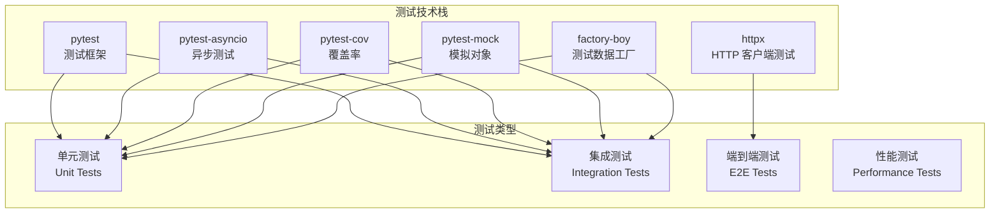

# 自动化测试方案

## 测试框架概述

本项目使用 **pytest** 作为主要测试框架，结合 **pytest-asyncio** 处理异步代码测试，**pytest-cov** 生成覆盖率报告。

### 测试栈组成



### 测试配置

项目已在 `pyproject.toml` 中配置了完整的测试环境：

```toml
[project.optional-dependencies]
dev = [
    "pytest>=7.4.0",
    "pytest-asyncio>=0.21.0",
    "pytest-cov>=4.1.0",
    "pytest-mock>=3.11.0",
    "httpx>=0.25.0",
    "factory-boy>=3.3.0",
    "faker>=19.0.0"
]

[tool.pytest.ini_options]
minversion = "7.0"
addopts = "-ra -q --strict-markers --strict-config --cov=agents --cov=api --cov=core"
testpaths = ["tests"]
markers = [
    "slow: marks tests as slow (deselect with '-m \"not slow\"')",
    "integration: marks tests as integration tests",
    "unit: marks tests as unit tests",
    "e2e: marks tests as end-to-end tests"
]
```

## 测试结构

### 目录组织

```
tests/
├── unit/                   # 单元测试
│   ├── agents/            # Agent 测试
│   │   ├── test_base.py
│   │   ├── test_pdf_agent.py
│   │   ├── test_translation_agent.py
│   │   └── test_workflow_agent.py
│   ├── api/               # API 测试
│   │   ├── test_routes/
│   │   ├── test_services/
│   │   └── test_models/
│   └── core/              # 核心功能测试
│       ├── test_config.py
│       └── test_utils.py
├── integration/            # 集成测试
│   ├── test_agent_workflows.py
│   ├── test_api_integration.py
│   └── test_skill_integration.py
├── e2e/                   # 端到端测试
│   ├── test_paper_pipeline.py
│   └── test_batch_processing.py
├── performance/           # 性能测试
│   ├── test_load.py
│   └── test_memory.py
├── fixtures/              # 测试数据
│   ├── papers/           # 示例论文
│   └── responses/        # Mock 响应
├── factories/             # 数据工厂
│   ├── __init__.py
│   ├── paper_factory.py
│   └── task_factory.py
└── conftest.py           # 测试配置和 Fixtures
```

## 单元测试

### Agent 测试

#### BaseAgent 测试

```python
# tests/unit/agents/test_base.py
import pytest
from unittest.mock import AsyncMock, patch
from agents.claude.base import BaseAgent

class TestBaseAgent:
    @pytest.fixture
    def agent_config(self):
        return {
            "name": "test_agent",
            "max_retries": 3,
            "timeout": 30
        }

    @pytest.fixture
    def agent(self, agent_config):
        return TestableAgent(agent_config)

    class TestableAgent(BaseAgent):
        required_skills = ["test_skill"]

        async def process(self, input_data):
            return {"success": True, "data": input_data}

        def validate_input(self, input_data):
            return "test_field" in input_data

    @pytest.mark.asyncio
    async def test_process_success(self, agent):
        """测试成功处理"""
        input_data = {"test_field": "value"}
        result = await agent.process(input_data)

        assert result["success"] is True
        assert result["data"] == input_data

    @pytest.mark.asyncio
    async def test_process_invalid_input(self, agent):
        """测试无效输入"""
        input_data = {"wrong_field": "value"}

        with pytest.raises(ValueError, match="Invalid input"):
            await agent.process(input_data)

    @pytest.mark.asyncio
    async def test_call_skill_success(self, agent):
        """测试技能调用成功"""
        with patch.object(agent, 'call_skill') as mock_skill:
            mock_skill.return_value = {"result": "success"}

            result = await agent.call_skill("test_skill", {})

            assert result == {"result": "success"}
            mock_skill.assert_called_once_with("test_skill", {})

    @pytest.mark.asyncio
    async def test_process_with_retry(self, agent):
        """测试重试机制"""
        with patch.object(agent, 'call_skill') as mock_skill:
            mock_skill.side_effect = [
                Exception("First failure"),
                {"result": "success"}
            ]

            result = await agent.process({"test_field": "value"})

            assert result["success"] is True
            assert mock_skill.call_count == 2
```

#### PDFProcessingAgent 测试

```python
# tests/unit/agents/test_pdf_agent.py
import pytest
from pathlib import Path
from agents.claude.pdf_agent import PDFProcessingAgent

class TestPDFProcessingAgent:
    @pytest.fixture
    def pdf_agent(self):
        config = {
            "output_dir": "tests/fixtures/output",
            "extract_images": True
        }
        return PDFProcessingAgent(config)

    @pytest.fixture
    def sample_pdf_path(self):
        return Path("tests/fixtures/papers/sample.pdf")

    @pytest.mark.asyncio
    async def test_extract_text(self, pdf_agent, sample_pdf_path):
        """测试文本提取"""
        with patch('pdf_reader_skill.extract') as mock_extract:
            mock_extract.return_value = {
                "text": "Sample PDF content",
                "metadata": {"pages": 5}
            }

            result = await pdf_agent.process_pdf(str(sample_pdf_path))

            assert result["text"] == "Sample PDF content"
            assert result["metadata"]["pages"] == 5

    @pytest.mark.asyncio
    async def test_extract_images(self, pdf_agent, sample_pdf_path):
        """测试图片提取"""
        with patch('pdf_reader_skill.extract_images') as mock_extract:
            mock_extract.return_value = [
                {"path": "image1.png", "caption": "Figure 1"}
            ]

            result = await pdf_agent.extract_images(str(sample_pdf_path))

            assert len(result) == 1
            assert result[0]["caption"] == "Figure 1"

    @pytest.mark.asyncio
    async def test_handle_corrupted_pdf(self, pdf_agent):
        """测试处理损坏的 PDF"""
        with patch('pdf_reader_skill.extract') as mock_extract:
            mock_extract.side_effect = Exception("Corrupted PDF")

            with pytest.raises(Exception, match="Corrupted PDF"):
                await pdf_agent.process_pdf("corrupted.pdf")
```

### API 测试

#### 路由测试

```python
# tests/unit/api/test_routes/test_papers.py
import pytest
from fastapi.testclient import TestClient
from unittest.mock import AsyncMock, patch
from api.main import app

client = TestClient(app)

class TestPaperRoutes:
    @pytest.fixture
    def mock_paper_service(self):
        with patch('api.routes.papers.PaperService') as mock:
            yield mock

    def test_upload_paper_success(self, mock_paper_service):
        """测试论文上传成功"""
        mock_service = mock_paper_service.return_value
        mock_service.upload_paper.return_value = {
            "id": "paper_123",
            "filename": "test.pdf"
        }

        with open("tests/fixtures/papers/sample.pdf", "rb") as f:
            response = client.post(
                "/api/papers/upload",
                files={"file": ("test.pdf", f, "application/pdf")},
                data={"category": "llm-agents"}
            )

        assert response.status_code == 200
        assert response.json()["id"] == "paper_123"

    def test_upload_invalid_file(self):
        """测试上传无效文件"""
        response = client.post(
            "/api/papers/upload",
            files={"file": ("test.txt", b"not a pdf", "text/plain")}
        )

        assert response.status_code == 400
        assert "Invalid file type" in response.json()["detail"]

    @pytest.mark.asyncio
    async def test_translate_paper(self, mock_paper_service):
        """测试翻译论文"""
        mock_service = mock_paper_service.return_value
        mock_service.translate_paper.return_value = {
            "task_id": "task_456",
            "status": "processing"
        }

        response = client.post("/api/papers/paper_123/translate")

        assert response.status_code == 200
        assert response.json()["task_id"] == "task_456"

    def test_get_paper_not_found(self, mock_paper_service):
        """测试获取不存在的论文"""
        mock_service = mock_paper_service.return_value
        mock_service.get_paper.return_value = None

        response = client.get("/api/papers/nonexistent")

        assert response.status_code == 404
```

#### 服务层测试

```python
# tests/unit/api/test_services/test_paper_service.py
import pytest
from unittest.mock import AsyncMock, MagicMock
from api.services.paper_service import PaperService

class TestPaperService:
    @pytest.fixture
    def paper_service(self):
        config = {
            "papers_dir": "tests/fixtures/papers",
            "max_file_size": 100 * 1024 * 1024  # 100MB
        }
        return PaperService(config)

    @pytest.fixture
    def mock_workflow_agent(self):
        with patch('api.services.paper_service.WorkflowAgent') as mock:
            yield mock

    @pytest.mark.asyncio
    async def test_upload_and_process(self, paper_service, mock_workflow_agent):
        """测试上传并处理论文"""
        # 模拟文件内容
        file_content = b"PDF content"
        filename = "test.pdf"
        category = "llm-agents"

        # 模拟 agent 返回
        mock_agent = mock_workflow_agent.return_value
        mock_agent.process_paper.return_value = {
            "id": "paper_123",
            "status": "uploaded"
        }

        result = await paper_service.upload_paper(
            file_content, filename, category
        )

        assert result["id"] == "paper_123"
        assert result["status"] == "uploaded"
        mock_agent.process_paper.assert_called_once()

    @pytest.mark.asyncio
    async def test_batch_translate(self, paper_service, mock_workflow_agent):
        """测试批量翻译"""
        paper_ids = ["paper_1", "paper_2", "paper_3"]
        mock_agent = mock_workflow_agent.return_value
        mock_agent.batch_translate.return_value = {
            "task_id": "batch_456",
            "total": 3
        }

        result = await paper_service.batch_translate(paper_ids)

        assert result["task_id"] == "batch_456"
        assert result["total"] == 3
```

### 数据模型测试

```python
# tests/unit/api/test_models/test_paper.py
import pytest
from pydantic import ValidationError
from api.models.paper import Paper, PaperCreate, PaperUpdate

class TestPaperModels:
    def test_paper_creation_valid(self):
        """测试有效的论文创建"""
        paper_data = {
            "id": "paper_123",
            "filename": "test.pdf",
            "category": "llm-agents",
            "status": "uploaded",
            "metadata": {
                "title": "Test Paper",
                "authors": ["Author A", "Author B"]
            }
        }

        paper = Paper(**paper_data)

        assert paper.id == "paper_123"
        assert paper.category == "llm-agents"
        assert paper.status == "uploaded"

    def test_paper_creation_invalid_status(self):
        """测试无效的状态值"""
        paper_data = {
            "id": "paper_123",
            "filename": "test.pdf",
            "status": "invalid_status"  # 无效状态
        }

        with pytest.raises(ValidationError):
            Paper(**paper_data)

    def test_paper_update_partial(self):
        """测试部分更新"""
        paper = Paper(
            id="paper_123",
            filename="test.pdf",
            category="llm-agents",
            status="uploaded"
        )

        update_data = PaperUpdate(status="translated")
        updated_paper = paper.copy(update=update_data.dict(exclude_unset=True))

        assert updated_paper.status == "translated"
        assert updated_paper.filename == "test.pdf"  # 未更改
```

## 集成测试

### Agent 工作流测试

```python
# tests/integration/test_agent_workflows.py
import pytest
import asyncio
from agents.claude.workflow_agent import WorkflowAgent
from agents.claude.pdf_agent import PDFProcessingAgent
from agents.claude.translation_agent import TranslationAgent

class TestAgentWorkflows:
    @pytest.fixture
    def workflow_config(self):
        return {
            "max_concurrent": 3,
            "timeout": 300,
            "output_dir": "tests/fixtures/output"
        }

    @pytest.fixture
    def workflow_agent(self, workflow_config):
        return WorkflowAgent(workflow_config)

    @pytest.mark.asyncio
    @pytest.mark.integration
    async def test_full_paper_processing_pipeline(self, workflow_agent):
        """测试完整的论文处理流水线"""
        # 准备测试数据
        paper_path = "tests/fixtures/papers/sample.pdf"

        # 执行完整流水线
        result = await workflow_agent.execute_pipeline({
            "paper_path": paper_path,
            "operations": ["extract", "translate", "analyze"],
            "options": {
                "preserve_formulas": True,
                "translation_style": "academic"
            }
        })

        # 验证结果
        assert result["success"] is True
        assert "extracted" in result
        assert "translated" in result
        assert "analyzed" in result

        # 验证输出文件
        assert Path(result["extracted"]["output_path"]).exists()
        assert Path(result["translated"]["output_path"]).exists()
        assert Path(result["analyzed"]["output_path"]).exists()

    @pytest.mark.asyncio
    @pytest.mark.integration
    async def test_batch_processing_workflow(self, workflow_agent):
        """测试批量处理工作流"""
        paper_paths = [
            "tests/fixtures/papers/paper1.pdf",
            "tests/fixtures/papers/paper2.pdf",
            "tests/fixtures/papers/paper3.pdf"
        ]

        results = await workflow_agent.process_batch({
            "papers": paper_paths,
            "operations": ["translate"],
            "batch_size": 2
        })

        assert len(results) == 3
        assert all(r["success"] for r in results)

    @pytest.mark.asyncio
    @pytest.mark.integration
    async def test_error_handling_in_workflow(self, workflow_agent):
        """测试工作流中的错误处理"""
        # 使用不存在的文件
        result = await workflow_agent.execute_pipeline({
            "paper_path": "nonexistent.pdf",
            "operations": ["extract"]
        })

        assert result["success"] is False
        assert "error" in result
        assert "File not found" in result["error"]
```

### API 集成测试

```python
# tests/integration/test_api_integration.py
import pytest
from httpx import AsyncClient
from api.main import app

class TestAPIIntegration:
    @pytest.mark.asyncio
    @pytest.mark.integration
    async def test_paper_upload_to_result_flow(self):
        """测试从上传到获取结果的完整流程"""
        async with AsyncClient(app=app, base_url="http://test") as ac:
            # 1. 上传论文
            with open("tests/fixtures/papers/sample.pdf", "rb") as f:
                upload_response = await ac.post(
                    "/api/papers/upload",
                    files={"file": ("sample.pdf", f, "application/pdf")},
                    data={"category": "llm-agents"}
                )

            assert upload_response.status_code == 200
            paper_id = upload_response.json()["id"]

            # 2. 开始翻译
            translate_response = await ac.post(
                f"/api/papers/{paper_id}/translate"
            )
            assert translate_response.status_code == 200
            task_id = translate_response.json()["task_id"]

            # 3. 轮询任务状态
            import time
            max_attempts = 30
            for _ in range(max_attempts):
                status_response = await ac.get(f"/api/tasks/{task_id}")
                status = status_response.json()

                if status["status"] == "completed":
                    break

                await asyncio.sleep(2)

            assert status["status"] == "completed"

            # 4. 获取翻译结果
            result_response = await ac.get(
                f"/api/papers/{paper_id}/translation"
            )
            assert result_response.status_code == 200
            assert "content" in result_response.json()

    @pytest.mark.asyncio
    @pytest.mark.integration
    async def test_websocket_progress_updates(self):
        """测试 WebSocket 进度更新"""
        with pytest.raises(Exception):
            async with AsyncClient(app=app, base_url="http://test") as ac:
                # 使用测试 WebSocket 客户端
                async with ac.websocket_connect("/ws/progress") as ws:
                    # 订阅任务
                    await ws.send_json({
                        "action": "subscribe",
                        "task_id": "test_task"
                    })

                    # 接收进度更新
                    message = await ws.receive_json()
                    assert message["type"] == "progress_update"
                    assert "task_id" in message
```

## 端到端测试

### 完整论文处理流程测试

```python
# tests/e2e/test_paper_pipeline.py
import pytest
import asyncio
from pathlib import Path
from agentic_papers import AgenticPapersClient

class TestPaperPipelineE2E:
    @pytest.fixture
    def client(self):
        return AgenticPapersClient(
            base_url="http://localhost:8000",
            api_key="test_key"
        )

    @pytest.mark.e2e
    @pytest.mark.slow
    async def test_complete_paper_workflow(self, client):
        """测试完整的论文处理工作流"""
        # 1. 上传新论文
        paper = client.upload_paper(
            "tests/fixtures/papers/complex_paper.pdf",
            category="llm-agents"
        )
        assert paper.status == "uploaded"

        # 2. 启动翻译
        translation_task = paper.translate(
            options={
                "preserve_formulas": True,
                "technical_mode": True
            }
        )
        assert translation_task.status == "processing"

        # 3. 等待翻译完成
        translation_result = await translation_task.wait_for_completion(
            timeout=300
        )
        assert translation_result.status == "completed"

        # 4. 启动深度分析
        analysis_task = paper.analyze()
        analysis_result = await analysis_task.wait_for_completion(
            timeout=300
        )
        assert analysis_result.status == "completed"

        # 5. 验证输出文件
        translation_file = paper.download_translation()
        analysis_file = paper.download_analysis()

        assert translation_file.exists()
        assert analysis_file.exists()

        # 6. 验证内容质量
        translation_content = translation_file.read_text(encoding='utf-8')
        assert len(translation_content) > 1000
        assert "## 摘要" in translation_content  # 中文内容

    @pytest.mark.e2e
    async def test_batch_processing_workflow(self, client):
        """测试批量处理工作流"""
        papers = []

        # 上传多个论文
        for pdf_path in Path("tests/fixtures/papers").glob("*.pdf"):
            paper = client.upload_paper(pdf_path, category="multi-agent")
            papers.append(paper)

        # 批量翻译
        batch_task = client.batch_translate([p.id for p in papers])
        batch_result = await batch_task.wait_for_completion(timeout=600)

        assert batch_result.success
        assert batch_result.completed == len(papers)

        # 验证所有论文都已翻译
        for paper in papers:
            paper.refresh()
            assert paper.status == "translated"
```

## 性能测试

### 负载测试

```python
# tests/performance/test_load.py
import pytest
import asyncio
import time
from concurrent.futures import ThreadPoolExecutor
from httpx import AsyncClient
from api.main import app

class TestLoadPerformance:
    @pytest.mark.performance
    async def test_concurrent_uploads(self):
        """测试并发上传性能"""
        concurrent_count = 10

        async def upload_paper(client, index):
            start_time = time.time()
            with open("tests/fixtures/papers/sample.pdf", "rb") as f:
                await client.post(
                    "/api/papers/upload",
                    files={"file": (f"test_{index}.pdf", f, "application/pdf")},
                    data={"category": "test"}
                )
            return time.time() - start_time

        async with AsyncClient(app=app, base_url="http://test") as ac:
            tasks = [upload_paper(ac, i) for i in range(concurrent_count)]
            durations = await asyncio.gather(*tasks)

        # 验证性能指标
        avg_duration = sum(durations) / len(durations)
        max_duration = max(durations)

        assert avg_duration < 5.0  # 平均响应时间小于 5 秒
        assert max_duration < 10.0  # 最大响应时间小于 10 秒

    @pytest.mark.performance
    async def test_memory_usage(self):
        """测试内存使用情况"""
        import psutil
        import os

        process = psutil.Process(os.getpid())
        initial_memory = process.memory_info().rss

        # 处理大量论文
        client = AgenticPapersClient()
        for _ in range(100):
            # 模拟处理（使用 mock 数据避免实际 API 调用）
            await client._process_mock_paper()

        final_memory = process.memory_info().rss
        memory_increase = final_memory - initial_memory

        # 内存增长不应超过 500MB
        assert memory_increase < 500 * 1024 * 1024

    @pytest.mark.performance
    @pytest.mark.slow
    async def test_sustained_load(self):
        """测试持续负载"""
        duration = 60  # 测试 60 秒
        requests_per_second = 5

        start_time = time.time()
        request_count = 0

        async with AsyncClient(app=app, base_url="http://test") as ac:
            while time.time() - start_time < duration:
                # 发送健康检查请求
                await ac.get("/health")
                request_count += 1
                await asyncio.sleep(1 / requests_per_second)

        # 验证系统稳定性
        assert request_count >= duration * requests_per_second * 0.9
```

## Mock 策略

### Agent Mock

```python
# tests/conftest.py
import pytest
from unittest.mock import AsyncMock, MagicMock

@pytest.fixture
def mock_pdf_agent():
    """Mock PDF Processing Agent"""
    agent = MagicMock()
    agent.process_pdf = AsyncMock(return_value={
        "text": "Mocked PDF content",
        "metadata": {"pages": 10, "title": "Mock Paper"},
        "images": []
    })
    agent.extract_images = AsyncMock(return_value=[
        {"path": "image1.png", "caption": "Mock Figure"}
    ])
    return agent

@pytest.fixture
def mock_translation_agent():
    """Mock Translation Agent"""
    agent = MagicMock()
    agent.translate = AsyncMock(return_value={
        "translated_text": "模拟的翻译内容",
        "preserved_elements": ["formulas", "images"]
    })
    return agent

@pytest.fixture
def mock_skill_responses():
    """Mock Skill 响应"""
    return {
        "pdf-reader": {
            "text": "Extracted PDF content",
            "metadata": {}
        },
        "zh-translator": {
            "translation": "翻译后的内容",
            "quality_score": 0.95
        },
        "heartfelt": {
            "summary": "论文摘要",
            "insights": ["洞见1", "洞见2"]
        }
    }
```

### API Mock

```python
# tests/conftest.py
@pytest.fixture
def mock_anthropic_api():
    """Mock Anthropic API"""
    with patch('anthropic.Anthropic') as mock:
        client = mock.return_value
        client.messages.create = AsyncMock(return_value={
            "content": [{"text": "Mocked Claude response"}]
        })
        yield client

@pytest.fixture
def mock_file_operations():
    """Mock 文件系统操作"""
    with patch('aiofiles.open') as mock_open:
        mock_file = MagicMock()
        mock_file.read.return_value = b"Mock file content"
        mock_open.return_value.__aenter__.return_value = mock_file
        yield mock_open
```

## 测试数据工厂

```python
# tests/factories/paper_factory.py
import factory
from faker import Faker
from api.models.paper import Paper, PaperStatus

fake = Faker()

class PaperFactory(factory.Factory):
    class Meta:
        model = Paper

    id = factory.Faker('uuid4')
    filename = factory.LazyAttribute(lambda o: f"{fake.word()}.pdf")
    category = factory.Iterator([
        "llm-agents",
        "context-engineering",
        "multi-agent",
        "knowledge-graphs"
    ])
    status = factory.Iterator(PaperStatus)
    metadata = factory.LazyAttribute(lambda o: {
        "title": fake.sentence(),
        "authors": [fake.name() for _ in range(fake.random_int(1, 5))],
        "year": fake.year(),
        "venue": fake.company()
    })
    created_at = factory.Faker('date_time')
    updated_at = factory.Faker('date_time')

class TaskFactory(factory.Factory):
    class Meta:
        model = Task  # 假设有 Task 模型

    id = factory.Faker('uuid4')
    paper_id = factory.SubFactory(PaperFactory).id
    type = factory.Iterator(["translate", "analyze", "batch"])
    status = factory.Iterator(["pending", "processing", "completed", "failed"])
    progress = factory.Faker('random_int', min=0, max=100)
    created_at = factory.Faker('date_time')
```

## CI/CD 集成

### GitHub Actions 配置

```yaml
# .github/workflows/test.yml
name: Test Suite

on:
  push:
    branches: [main, develop]
  pull_request:
    branches: [main]

jobs:
  test:
    runs-on: ubuntu-latest
    strategy:
      matrix:
        python-version: [3.12]

    services:
      # 如果需要数据库等服务
      # redis:
      #   image: redis:6
      #   ports:
      #     - 6379:6379

    steps:
      - uses: actions/checkout@v3

      - name: Set up Python ${{ matrix.python-version }}
        uses: actions/setup-python@v4
        with:
          python-version: ${{ matrix.python-version }}

      - name: Cache pip dependencies
        uses: actions/cache@v3
        with:
          path: ~/.cache/pip
          key: ${{ runner.os }}-pip-${{ hashFiles('**/pyproject.toml') }}

      - name: Install dependencies
        run: |
          python -m pip install --upgrade pip
          pip install -e ".[dev]"

      - name: Lint with ruff
        run: ruff check .

      - name: Type check with mypy
        run: mypy .

      - name: Run unit tests
        run: pytest tests/unit -v --cov=agents --cov=api --cov=core

      - name: Run integration tests
        run: pytest tests/integration -v
        env:
          ANTHROPIC_API_KEY: ${{ secrets.ANTHROPIC_API_KEY }}

      - name: Upload coverage reports
        uses: codecov/codecov-action@v3
        with:
          file: ./coverage.xml
```

### 测试覆盖率配置

```yaml
# .github/workflows/coverage.yml
name: Coverage Report

on:
  push:
    branches: [main]

jobs:
  coverage:
    runs-on: ubuntu-latest

    steps:
      - uses: actions/checkout@v3

      - name: Set up Python
        uses: actions/setup-python@v4
        with:
          python-version: 3.12

      - name: Install dependencies
        run: |
          pip install -e ".[dev]"

      - name: Run tests with coverage
        run: |
          pytest --cov=agents --cov=api --cov=core \
                 --cov-report=xml --cov-report=html

      - name: Upload coverage to Codecov
        uses: codecov/codecov-action@v3
```

## 测试最佳实践

### 1. 测试命名

```python
# 好的测试命名
def test_upload_paper_with_valid_pdf_returns_success():
    """清晰的测试名称，说明测试的场景和期望"""

def test_translate_paper_when_api_key_invalid_returns_error():
    """包含测试条件和预期结果"""

# 避免的命名
def test_upload():
    """过于模糊"""
```

### 2. 测试组织

```python
class TestPaperUpload:
    """相关测试组织在同一个类中"""

    def test_valid_pdf(self):
        pass

    def test_invalid_file_type(self):
        pass

    def test_file_too_large(self):
        pass
```

### 3. 测试隔离

```python
@pytest.fixture(autouse=True)
def cleanup_test_data():
    """自动清理测试数据"""
    yield
    # 清理操作
    cleanup_test_files()
    reset_database()
```

### 4. 参数化测试

```python
@pytest.mark.parametrize("file_type,expected_status", [
    ("application/pdf", 200),
    ("text/plain", 400),
    ("image/jpeg", 400)
])
def test_upload_different_file_types(self, file_type, expected_status):
    """使用参数化测试多种情况"""
    # 测试代码
```

### 5. 异步测试

```python
@pytest.mark.asyncio
async def test_async_operation(self):
    """异步测试必须使用 pytest-asyncio"""
    result = await some_async_function()
    assert result
```

## 持续改进

### 测试指标

- 代码覆盖率目标：> 80%
- 单元测试比例：> 70%
- 测试执行时间：< 5 分钟
- 测试稳定性：> 95%

### 测试审查清单

- [ ] 测试是否有清晰的目的
- [ ] 测试是否独立，不依赖其他测试
- [ ] 测试是否覆盖了边界情况
- [ ] 测试是否有适当的断言
- [ ] 测试是否有清晰的错误信息
- [ ] Mock 是否正确设置
- [ ] 测试数据是否合适
- [ ] 测试是否快速执行
