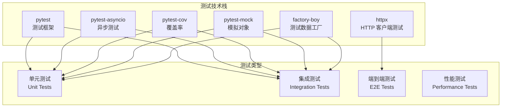

# 自动化测试方案

## 测试框架概述

本项目使用 **pytest** 作为主要测试框架，结合 **pytest-asyncio** 处理异步代码测试，**pytest-cov** 生成覆盖率报告。

### 测试栈组成



### 测试目标

- 代码覆盖率目标：> 80%
- 单元测试比例：> 70%
- 测试执行时间：< 5 分钟
- 测试稳定性：> 95%

## 快速开始

### 安装测试依赖

```bash
pip install -e ".[dev]"
```

### 运行所有测试

```bash
# 使用项目提供的测试脚本 (从tests/agents目录)
python run_tests.py

# 或者从项目根目录运行
python tests/agents/run_tests.py

# 或者直接使用pytest
pytest tests/agents -v
```

### 运行特定类型的测试

```bash
# 只运行单元测试
pytest tests/agents/unit -v

# 只运行集成测试
pytest tests/agents/integration -v

# 运行特定测试文件
pytest tests/agents/unit/api/services/test_paper_service.py -v
```

### 生成覆盖率报告

```bash
pytest tests/agents --cov=agents --cov-report=html
# 报告将生成在 htmlcov/index.html
```

### 运行带标记的测试

```bash
# 跳过慢速测试
pytest tests/agents -m "not slow"

# 只运行集成测试
pytest tests/agents -m integration

# 运行WebSocket相关测试
pytest tests/agents -m websocket
```

## 测试结构

### 目录组织

```
tests/agents/
├── conftest.py              # 全局测试配置和fixtures
├── unit/                    # 单元测试
│   ├── agents/             # Agent层测试
│   │   └── test_workflow_agent.py
│   └── api/                # API层测试
│       ├── services/       # 服务层测试
│       │   └── test_paper_service.py
│       └── routes/         # 路由测试
│           └── test_papers_routes.py
├── integration/             # 集成测试
│   └── test_api_integration.py
├── fixtures/               # 测试工具和数据
│   ├── factories/          # 数据工厂
│   │   ├── paper_factory.py
│   │   └── task_factory.py
│   └── mocks/              # Mock配置
│       ├── mock_claude_api.py
│       ├── mock_file_operations.py
│       └── mock_websocket.py
└── data/                  # 测试数据
    └── sample_papers/
        └── sample.pdf
```

### 测试配置

项目已在 `pyproject.toml` 中配置了完整的测试环境：

```toml
[project.optional-dependencies]
dev = [
    "pytest>=7.4.0",
    "pytest-asyncio>=0.21.0",
    "pytest-cov>=4.1.0",
    "pytest-mock>=3.11.0",
    "httpx>=0.25.0",
    "factory-boy>=3.3.0",
    "faker>=19.0.0"
]

[tool.pytest.ini_options]
minversion = "7.0"
addopts = [
    "-ra",
    "-q",
    "--strict-markers",
    "--strict-config",
    "--cov=agents",
    "--cov-report=term-missing",
    "--cov-report=html:htmlcov",
    "--cov-report=xml",
    "--cov-fail-under=80",
    "-p no:warnings",
]
testpaths = [
    "tests",
]
asyncio_mode = "auto"
markers = [
    "slow: marks tests as slow (deselect with '-m \"not slow\"')",
    "integration: marks tests as integration tests",
    "unit: marks tests as unit tests",
    "e2e: marks tests as end-to-end tests",
    "performance: marks tests as performance tests",
    "websocket: marks tests that require WebSocket",
]
```

## 测试类型与示例

### 单元测试

#### Agent 测试

##### BaseAgent 测试

```python
# tests/unit/agents/test_base.py
import pytest
from unittest.mock import AsyncMock, patch
from agents.claude.base import BaseAgent

class TestBaseAgent:
    @pytest.fixture
    def agent_config(self):
        return {
            "name": "test_agent",
            "max_retries": 3,
            "timeout": 30
        }

    @pytest.fixture
    def agent(self, agent_config):
        return TestableAgent(agent_config)

    class TestableAgent(BaseAgent):
        required_skills = ["test_skill"]

        async def process(self, input_data):
            return {"success": True, "data": input_data}

        def validate_input(self, input_data):
            return "test_field" in input_data

    @pytest.mark.asyncio
    async def test_process_success(self, agent):
        """测试成功处理"""
        input_data = {"test_field": "value"}
        result = await agent.process(input_data)

        assert result["success"] is True
        assert result["data"] == input_data

    @pytest.mark.asyncio
    async def test_process_invalid_input(self, agent):
        """测试无效输入"""
        input_data = {"wrong_field": "value"}

        with pytest.raises(ValueError, match="Invalid input"):
            await agent.process(input_data)

    @pytest.mark.asyncio
    async def test_call_skill_success(self, agent):
        """测试技能调用成功"""
        with patch.object(agent, 'call_skill') as mock_skill:
            mock_skill.return_value = {"result": "success"}

            result = await agent.call_skill("test_skill", {})

            assert result == {"result": "success"}
            mock_skill.assert_called_once_with("test_skill", {})

    @pytest.mark.asyncio
    async def test_process_with_retry(self, agent):
        """测试重试机制"""
        with patch.object(agent, 'call_skill') as mock_skill:
            mock_skill.side_effect = [
                Exception("First failure"),
                {"result": "success"}
            ]

            result = await agent.process({"test_field": "value"})

            assert result["success"] is True
            assert mock_skill.call_count == 2
```

#### PDFProcessingAgent 测试

```python
# tests/unit/agents/test_pdf_agent.py
import pytest
from pathlib import Path
from agents.claude.pdf_agent import PDFProcessingAgent

class TestPDFProcessingAgent:
    @pytest.fixture
    def pdf_agent(self):
        config = {
            "output_dir": "tests/fixtures/output",
            "extract_images": True
        }
        return PDFProcessingAgent(config)

    @pytest.fixture
    def sample_pdf_path(self):
        return Path("tests/fixtures/papers/sample.pdf")

    @pytest.mark.asyncio
    async def test_extract_text(self, pdf_agent, sample_pdf_path):
        """测试文本提取"""
        with patch('pdf_reader_skill.extract') as mock_extract:
            mock_extract.return_value = {
                "text": "Sample PDF content",
                "metadata": {"pages": 5}
            }

            result = await pdf_agent.process_pdf(str(sample_pdf_path))

            assert result["text"] == "Sample PDF content"
            assert result["metadata"]["pages"] == 5

    @pytest.mark.asyncio
    async def test_extract_images(self, pdf_agent, sample_pdf_path):
        """测试图片提取"""
        with patch('pdf_reader_skill.extract_images') as mock_extract:
            mock_extract.return_value = [
                {"path": "image1.png", "caption": "Figure 1"}
            ]

            result = await pdf_agent.extract_images(str(sample_pdf_path))

            assert len(result) == 1
            assert result[0]["caption"] == "Figure 1"
```

### API 测试

#### 路由测试

```python
# tests/unit/api/test_routes/test_papers.py
import pytest
from fastapi.testclient import TestClient
from unittest.mock import AsyncMock, patch
from api.main import app

client = TestClient(app)

class TestPaperRoutes:
    @pytest.fixture
    def mock_paper_service(self):
        with patch('api.routes.papers.PaperService') as mock:
            yield mock

    def test_upload_paper_success(self, mock_paper_service):
        """测试论文上传成功"""
        mock_service = mock_paper_service.return_value
        mock_service.upload_paper.return_value = {
            "id": "paper_123",
            "filename": "test.pdf"
        }

        with open("tests/fixtures/papers/sample.pdf", "rb") as f:
            response = client.post(
                "/api/papers/upload",
                files={"file": ("test.pdf", f, "application/pdf")},
                data={"category": "llm-agents"}
            )

        assert response.status_code == 200
        assert response.json()["id"] == "paper_123"

    def test_upload_invalid_file(self):
        """测试上传无效文件"""
        response = client.post(
            "/api/papers/upload",
            files={"file": ("test.txt", b"not a pdf", "text/plain")}
        )

        assert response.status_code == 400
        assert "Invalid file type" in response.json()["detail"]
```

#### 服务层测试

```python
# tests/unit/api/test_services/test_paper_service.py
import pytest
from unittest.mock import AsyncMock, MagicMock
from api.services.paper_service import PaperService

class TestPaperService:
    @pytest.fixture
    def paper_service(self):
        config = {
            "papers_dir": "tests/fixtures/papers",
            "max_file_size": 100 * 1024 * 1024  # 100MB
        }
        return PaperService(config)

    @pytest.fixture
    def mock_workflow_agent(self):
        with patch('api.services.paper_service.WorkflowAgent') as mock:
            yield mock

    @pytest.mark.asyncio
    async def test_upload_and_process(self, paper_service, mock_workflow_agent):
        """测试上传并处理论文"""
        file_content = b"PDF content"
        filename = "test.pdf"
        category = "llm-agents"

        mock_agent = mock_workflow_agent.return_value
        mock_agent.process_paper.return_value = {
            "id": "paper_123",
            "status": "uploaded"
        }

        result = await paper_service.upload_paper(
            file_content, filename, category
        )

        assert result["id"] == "paper_123"
        assert result["status"] == "uploaded"
```

### 集成测试

```python
# tests/integration/test_api_integration.py
import pytest
from httpx import AsyncClient
from api.main import app

class TestAPIIntegration:
    @pytest.mark.asyncio
    @pytest.mark.integration
    async def test_paper_upload_to_result_flow(self):
        """测试从上传到获取结果的完整流程"""
        async with AsyncClient(app=app, base_url="http://test") as ac:
            # 1. 上传论文
            with open("tests/fixtures/papers/sample.pdf", "rb") as f:
                upload_response = await ac.post(
                    "/api/papers/upload",
                    files={"file": ("sample.pdf", f, "application/pdf")},
                    data={"category": "llm-agents"}
                )

            assert upload_response.status_code == 200
            paper_id = upload_response.json()["id"]

            # 2. 开始翻译
            translate_response = await ac.post(
                f"/api/papers/{paper_id}/translate"
            )
            assert translate_response.status_code == 200
            task_id = translate_response.json()["task_id"]

            # 3. 轮询任务状态
            import time
            max_attempts = 30
            for _ in range(max_attempts):
                status_response = await ac.get(f"/api/tasks/{task_id}")
                status = status_response.json()

                if status["status"] == "completed":
                    break

                await asyncio.sleep(2)

            assert status["status"] == "completed"

            # 4. 获取翻译结果
            result_response = await ac.get(
                f"/api/papers/{paper_id}/translation"
            )
            assert result_response.status_code == 200
            assert "content" in result_response.json()
```

### 端到端测试

```python
# tests/e2e/test_paper_pipeline.py
import pytest
import asyncio
from pathlib import Path
from agentic_papers import AgenticPapersClient

class TestPaperPipelineE2E:
    @pytest.fixture
    def client(self):
        return AgenticPapersClient(
            base_url="http://localhost:8000",
            api_key="test_key"
        )

    @pytest.mark.e2e
    @pytest.mark.slow
    async def test_complete_paper_workflow(self, client):
        """测试完整的论文处理工作流"""
        # 1. 上传新论文
        paper = client.upload_paper(
            "tests/fixtures/papers/complex_paper.pdf",
            category="llm-agents"
        )
        assert paper.status == "uploaded"

        # 2. 启动翻译
        translation_task = paper.translate(
            options={
                "preserve_formulas": True,
                "technical_mode": True
            }
        )
        assert translation_task.status == "processing"

        # 3. 等待翻译完成
        translation_result = await translation_task.wait_for_completion(
            timeout=300
        )
        assert translation_result.status == "completed"
```

### 性能测试

```python
# tests/performance/test_load.py
import pytest
import asyncio
import time
from concurrent.futures import ThreadPoolExecutor
from httpx import AsyncClient
from api.main import app

class TestLoadPerformance:
    @pytest.mark.performance
    async def test_concurrent_uploads(self):
        """测试并发上传性能"""
        concurrent_count = 10

        async def upload_paper(client, index):
            start_time = time.time()
            with open("tests/fixtures/papers/sample.pdf", "rb") as f:
                await client.post(
                    "/api/papers/upload",
                    files={"file": (f"test_{index}.pdf", f, "application/pdf")},
                    data={"category": "test"}
                )
            return time.time() - start_time

        async with AsyncClient(app=app, base_url="http://test") as ac:
            tasks = [upload_paper(ac, i) for i in range(concurrent_count)]
            durations = await asyncio.gather(*tasks)

        # 验证性能指标
        avg_duration = sum(durations) / len(durations)
        max_duration = max(durations)

        assert avg_duration < 5.0  # 平均响应时间小于 5 秒
        assert max_duration < 10.0  # 最大响应时间小于 10 秒
```

## Mock 策略

### 外部依赖 Mock

- **Claude API**: 使用 `mock_claude_api.py` 模拟所有 Claude API 调用
- **文件系统**: 使用 `mock_file_operations.py` 模拟文件读写操作
- **WebSocket**: 使用 `mock_websocket.py` 模拟实时通信

### 数据生成

使用 `factory-boy` 生成测试数据：

- `PaperFactory`: 生成论文相关数据
- `TaskFactory`: 生成任务相关数据

### 示例 Mock 配置

```python
# tests/conftest.py
import pytest
from unittest.mock import AsyncMock, MagicMock

@pytest.fixture
def mock_pdf_agent():
    """Mock PDF Processing Agent"""
    agent = MagicMock()
    agent.process_pdf = AsyncMock(return_value={
        "text": "Mocked PDF content",
        "metadata": {"pages": 10, "title": "Mock Paper"},
        "images": []
    })
    agent.extract_images = AsyncMock(return_value=[
        {"path": "image1.png", "caption": "Mock Figure"}
    ])
    return agent

@pytest.fixture
def mock_anthropic_api():
    """Mock Anthropic API"""
    with patch('anthropic.Anthropic') as mock:
        client = mock.return_value
        client.messages.create = AsyncMock(return_value={
            "content": [{"text": "Mocked Claude response"}]
        })
        yield client
```

## 测试数据工厂

```python
# tests/factories/paper_factory.py
import factory
from faker import Faker
from api.models.paper import Paper, PaperStatus

fake = Faker()

class PaperFactory(factory.Factory):
    class Meta:
        model = Paper

    id = factory.Faker('uuid4')
    filename = factory.LazyAttribute(lambda o: f"{fake.word()}.pdf")
    category = factory.Iterator([
        "llm-agents",
        "context-engineering",
        "multi-agent",
        "knowledge-graphs"
    ])
    status = factory.Iterator(PaperStatus)
    metadata = factory.LazyAttribute(lambda o: {
        "title": fake.sentence(),
        "authors": [fake.name() for _ in range(fake.random_int(1, 5))],
        "year": fake.year(),
        "venue": fake.company()
    })
    created_at = factory.Faker('date_time')
    updated_at = factory.Faker('date_time')
```

## 测试覆盖范围

### 已实现的测试覆盖

1. **PaperService 测试**

   - 文件上传流程
   - 论文处理工作流
   - 状态跟踪
   - 批量处理
   - 错误处理

2. **API 路由测试**

   - 所有 API 端点
   - 请求/响应验证
   - 错误状态码
   - 参数验证
   - 分页功能

3. **WorkflowAgent 测试**

   - 完整处理流程
   - 各种工作流类型
   - 子 Agent 协调
   - 错误恢复

4. **集成测试**
   - 端到端处理流程
   - WebSocket 通信
   - 并发请求处理
   - 批量操作

## CI/CD 集成

### GitHub Actions 配置

```yaml
# .github/workflows/test.yml
name: Test Suite

on:
  push:
    branches: [main, develop]
  pull_request:
    branches: [main]

jobs:
  test:
    runs-on: ubuntu-latest
    strategy:
      matrix:
        python-version: [3.12]

    steps:
      - uses: actions/checkout@v3

      - name: Set up Python ${{ matrix.python-version }}
        uses: actions/setup-python@v4
        with:
          python-version: ${{ matrix.python-version }}

      - name: Cache pip dependencies
        uses: actions/cache@v3
        with:
          path: ~/.cache/pip
          key: ${{ runner.os }}-pip-${{ hashFiles('**/pyproject.toml') }}

      - name: Install dependencies
        run: |
          python -m pip install --upgrade pip
          pip install -e ".[dev]"

      - name: Lint with ruff
        run: ruff check .

      - name: Type check with mypy
        run: mypy .

      - name: Run unit tests
        run: pytest tests/unit -v --cov=agents --cov=api --cov=core

      - name: Run integration tests
        run: pytest tests/integration -v
        env:
          ANTHROPIC_API_KEY: ${{ secrets.ANTHROPIC_API_KEY }}

      - name: Upload coverage reports
        uses: codecov/codecov-action@v3
        with:
          file: ./coverage.xml
```

## 故障排除

### 常见问题

1. **导入错误**: 确保在测试中正确设置 Python 路径
2. **AsyncMock 问题**: 检查异步方法是否正确 mock
3. **临时文件清理**: 使用 pytest 的 tmp_path fixture 自动清理
4. **覆盖率不正确**: 检查 cov 配置是否包含正确的路径

### 调试技巧

```bash
# 显示详细的测试输出
pytest -v -s tests/agents

# 只运行失败的测试
pytest --lf

# 在第一个失败时停止
pytest -x

# 显示本地变量
pytest --tb=long
```

## 最佳实践

### 1. 测试命名

```python
# 好的测试命名
def test_upload_paper_with_valid_pdf_returns_success():
    """清晰的测试名称，说明测试的场景和期望"""

def test_translate_paper_when_api_key_invalid_returns_error():
    """包含测试条件和预期结果"""

# 避免的命名
def test_upload():
    """过于模糊"""
```

### 2. 测试组织

```python
class TestPaperUpload:
    """相关测试组织在同一个类中"""

    def test_valid_pdf(self):
        pass

    def test_invalid_file_type(self):
        pass

    def test_file_too_large(self):
        pass
```

### 3. 测试隔离

```python
@pytest.fixture(autouse=True)
def cleanup_test_data():
    """自动清理测试数据"""
    yield
    # 清理操作
    cleanup_test_files()
    reset_database()
```

### 4. 参数化测试

```python
@pytest.mark.parametrize("file_type,expected_status", [
    ("application/pdf", 200),
    ("text/plain", 400),
    ("image/jpeg", 400)
])
def test_upload_different_file_types(self, file_type, expected_status):
    """使用参数化测试多种情况"""
    # 测试代码
```

### 5. 异步测试

```python
@pytest.mark.asyncio
async def test_async_operation(self):
    """异步测试必须使用 pytest-asyncio"""
    result = await some_async_function()
    assert result
```

### 6. 核心原则

1. **测试隔离**: 每个测试使用独立的临时目录和数据
2. **Mock 使用**: 对外部依赖使用 Mock 避免实际调用
3. **异步测试**: 使用 `pytest-asyncio` 处理异步代码
4. **覆盖率目标**: 保持 >80% 的代码覆盖率
5. **清晰命名**: 测试名称应该清楚描述测试的场景和期望

## 添加新测试

1. 单元测试放在 `tests/agents/unit/` 对应模块下
2. 集成测试放在 `tests/agents/integration/`
3. 使用现有的 fixtures 和 mocks
4. 确保测试标记正确（unit, integration 等）
5. 运行所有测试确保没有破坏现有功能

## 持续改进

### 测试审查清单

- [ ] 测试是否有清晰的目的
- [ ] 测试是否独立，不依赖其他测试
- [ ] 测试是否覆盖了边界情况
- [ ] 测试是否有适当的断言
- [ ] 测试是否有清晰的错误信息
- [ ] Mock 是否正确设置
- [ ] 测试数据是否合适
- [ ] 测试是否快速执行
